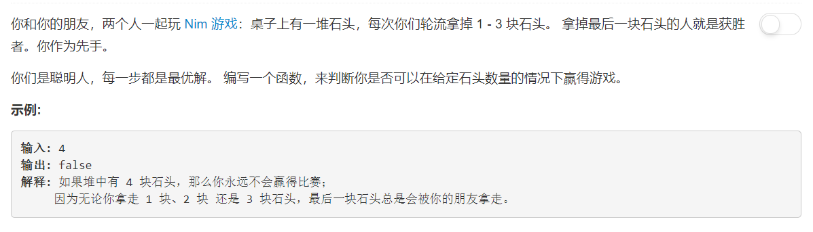

# 292 - Nim游戏

## 题目描述



## 题解
>拿到这道题的时候脑子里就冒出一句“好复杂啊，两个人选择的情况太多了吧”，看到旁边related topics里面竟然有brainteaser，昂？看了大神的解答之后恍然大悟，所噶。。。  所以大家都说这是一道math题而不是algorithm题，甚至有人说如果他是interviewer他会更倾向于录用老老实实解题而不是trick的，嗯然后遭到了大家的反对，“你要是专门考算法就找更适合的题啊，只能说明你不是一个合格的面试官。”

嗯好哒，下面是大神的解答，我觉得解释的很清楚就不翻译了直接搬过来：[1 liner with explanations](https://leetcode.com/problems/nim-game/discuss/73851/1-liner-with-explanations).

```python
class Solution(object):
    def canWinNim(self, n):
        """
        :type n: int
        :rtype: bool
        """
        # strategy: the one with 4 remaining must loose
        # A, B players
        # if n == 4k, then at each round B can make A+B both take 4, 
        # eventually leave 4 to A, A lose
        # if n == 4k + i (i <= 3), then A can always take i first and B will
        # finanly lose as he faces above scenario like A

        return bool(n % 4 != 0)
```

`return bool(n % 4 != 0)`这一句还可以简化成`return  n % 4 != 0`或者`return n % 4`都是可以哒！  
还有同一个思路，用位运算实现的，会比模运算快一点：

```python
class Solution(object):
    def canWinNim(self, n):
        """
        :type n: int
        :rtype: bool
        """
        return bool( n & 3 != 0 )
```
