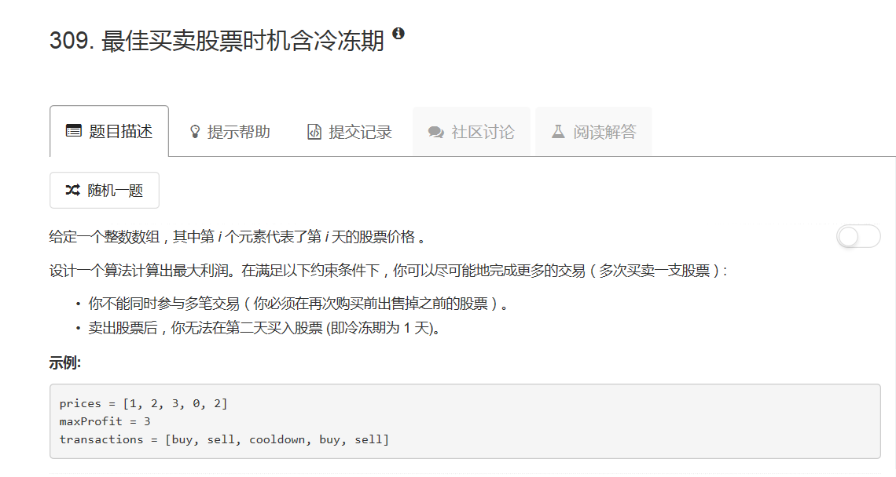
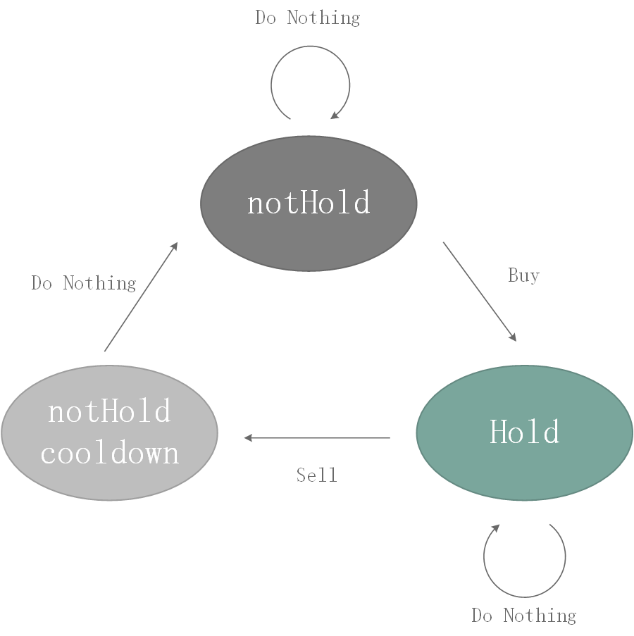

# 309 - 买卖股票的最佳时机含冷冻期

## 题目描述


>关联题目：  
- [121. 买卖股票的最佳时机](https://github.com/Rosevil1874/LeetCode/tree/master/Python-Solution/121_Best-Time-to-Buy-and-Sell-Stock)
- [122. 买卖股票的最佳时机II](https://github.com/Rosevil1874/LeetCode/tree/master/Python-Solution/122_Best-Time-to-Buy-and-Sell-Stock-II)
- [123. 买卖股票的最佳时机III](https://github.com/Rosevil1874/LeetCode/tree/master/Python-Solution/123_Best-Time-to-Buy-and-Sell-Stock-III)
- [188. 买卖股票的最佳时机IV](https://github.com/Rosevil1874/LeetCode/tree/master/Python-Solution/188_Best-Time-to-Buy-and-Sell-Stock-IV)
- [714. 买卖股票的最佳时机含手续费](https://github.com/Rosevil1874/LeetCode/tree/master/Python-Solution/714_Best-Time-to-Buy-and-Sell-Stock-with-Transaction-Fee)

>审题：  
此题是[122. 买卖股票的最佳时机II](https://github.com/Rosevil1874/LeetCode/tree/master/Python-Solution/122_Best-Time-to-Buy-and-Sell-Stock-II)的进阶版，所谓进阶就是加了一个条件：**卖出股票后，你无法在第二天买入股票 (即冷冻期为 1 天)**。

## 动态规划
我真是。。。很弱啊。。。  
这题感觉看大神的思路都有一点点困难的说。。。  
cr: [4-line Python solution, 52 ms](https://leetcode.com/problems/best-time-to-buy-and-sell-stock-with-cooldown/discuss/75942/4-line-Python-solution-52-ms)

>思路：  
The key is 3 states and 5 edges for state transition. 3 states are `notHold (stock)`, `hold (stock)`, and `notHold_cooldown`. The initial values of the latter two are negative infinity since they are meaningless, i.e. you won't hold stocks at first and there's no cooldown at first. The 5 edges:
1. `hold` -----do nothing----->`hold`
2. `hold` -----sell----->`notHold_cooldown`
3. `notHold` -----do nothing -----> `notHold`
4. `notHold` -----buy-----> `hold`
5. `notHold_cooldown` -----do nothing----->`notHold`

参照另一个回答中的状态图画了一个便于理解：


最后取`max(hold, notHold, notHold_cooldown)`是因为交易序列可能在任意一种状态下结束。

> Runtime: 28 ms, faster than 99.38% of Python3 online submissions

```python
class Solution(object):
    def maxProfit(self, prices: List[int]) -> int:
        notHold = 0                         # 开始状态
        hold = float('-inf')                # 不可能一开始就持有股票
        notHold_cooldown = float('-inf')    # 不可能一开始就冷冻
        for p in prices:
            hold = max(hold, notHold - p)               # 一直持有股票或买了股票(钱少了)
            notHold = max(notHold, notHold_cooldown)    # 一直未持有股票或刚渡过冷冻期
            notHold_cooldown = hold + p                 # 刚卖掉了股票（钱多了）进入冷冻期
        return max(hold, notHold, notHold_cooldown)
```