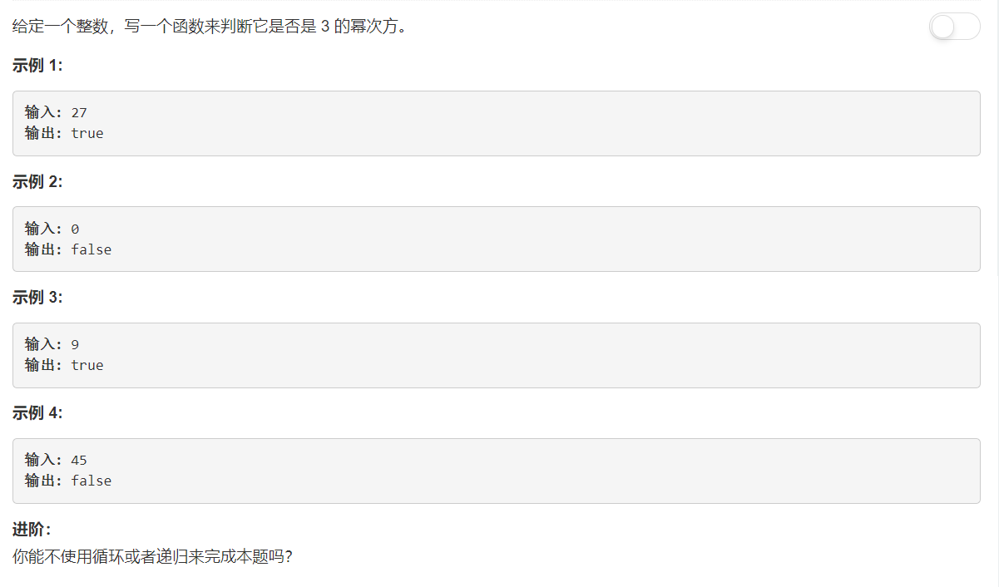
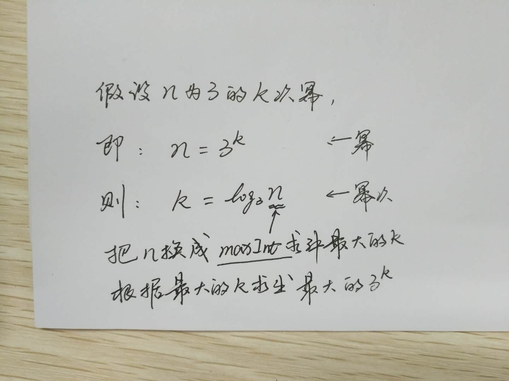

# 326 - 3的幂

## 题目描述


>关联题目： [231. 2的幂](https://github.com/Rosevil1874/LeetCode/tree/master/Python-Solution/231_Powe-of-Two)
>关联题目： [342. 4的幂](https://github.com/Rosevil1874/LeetCode/tree/master/Python-Solution/231_Powe-of-Four)


## 题解一：【除法运算】
**思路：** 最原始的方法，一直除以3。

```python
class Solution:
    def isPowerOfThree(self, n: int) -> bool:
        if n <= 0:
            return False
        
        while n % 3 == 0:
            n //= 3
        return n == 1
```

## 题解二：
>人家题目上让不用循环或者递归解题呢，，那我，想不出来啊。。。于是网上冲浪一波抄抄别人的思路: 先求出最大的3的幂，然后看n能不能被这个最大的3的幂整除就行啦。


> 换底公式：log a b = log c b / log c a

```python
class Solution:
    def isPowerOfThree(self, n: int) -> bool:
        if n <= 0:
            return False
        
        MAX = 0X7FFFFFFF
        # 换底公式求最大幂次，再使用最大幂次求最大幂
        MAX_3power = 3 ** (math.log(MAX) // math.log(3))
        return MAX_3power % n == 0
```