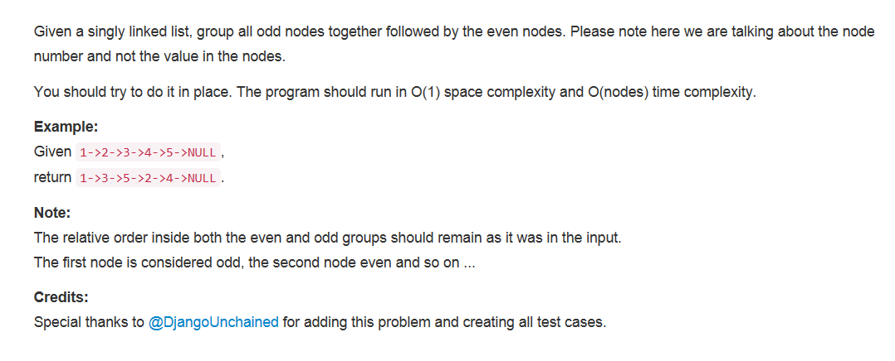

## 题目描述


<!-- more -->

>审题
1. 将所有奇数位置的结点移动到偶数位置结点的前面
2. in place
3. O(1) space complexity and O(nodes) time complexity
4. 保持相对位置不变

## 方法
1. 将所有奇数位置的结点单独拿出来放在子链表里，odd指向其尾；
2. 指针even指向剩余链表中最后一个偶数位置结点，其后是还需要移动到子链表的奇数位置结点；
3. 要保持相对位置不变，每次把even后面的结点移动到odd后面就行；
4. 最后剩余链表中都是偶数位置的结点，将其接到奇数位置结点子链表后面，返回。

```python
# Definition for singly-linked list.
# class ListNode(object):
#     def __init__(self, x):
#         self.val = x
#         self.next = None

class Solution(object):
    def oddEvenList(self, head):
        """
        :type head: ListNode
        :rtype: ListNode
        """
        # 少于三个结点的都不用移动，直接返回
        if not head or not head.next or not head.next.next:
            return head

        # 将odd单独分出来组成一个子链表，然后把剩余的even链表接在其后
        odd = head
        even = evenHead = head.next
        while even and even.next:
            odd.next = even.next
            odd = odd.next
            even.next = odd.next
            even = even.next
        odd.next = evenHead
        return head
```
