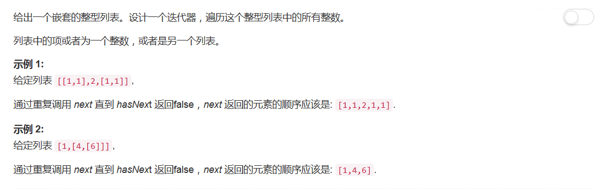

# 341 - 扁平化嵌套列表迭代器

## 题目描述


## 栈stack
可能直接让我遍历的话思路会捋的比较清晰，上来就是一大坨数据结构，恕在下有点蒙圈。而且这个不能本地测试啊，虽然很多人建议刷LeetCode最好不要再在本地测试了再粘贴上去，但是。。。等我（也许）二刷的时候再说吧。  
>参考了[8-line Python Solution](https://leetcode.com/problems/flatten-nested-list-iterator/discuss/80142/8-line-Python-Solution)

思路：  
- \__init__（初始化）： 将整个嵌套的整型列表直接倒序放入栈中，从栈顶往下就是第一个元素到最后一个元素；
- next(获取下一个遍历元素/整型)： 返回栈顶元素中的整型元素；
- hasNext(判断列表是否有next)：
	- 若栈顶是整型元素，返回true;
	- 若栈顶是嵌套列表，将其拆分成整型元素放入栈中，再返回true；
	- 若栈为空，返回false

```python
# """
# This is the interface that allows for creating nested lists.
# You should not implement it, or speculate about its implementation
# """
#class NestedInteger:
#    def isInteger(self) -> bool:
#        """
#        @return True if this NestedInteger holds a single integer, rather than a nested list.
#        """
#
#    def getInteger(self) -> int:
#        """
#        @return the single integer that this NestedInteger holds, if it holds a single integer
#        Return None if this NestedInteger holds a nested list
#        """
#
#    def getList(self) -> [NestedInteger]:
#        """
#        @return the nested list that this NestedInteger holds, if it holds a nested list
#        Return None if this NestedInteger holds a single integer
#        """

class NestedIterator:
    def __init__(self, nestedList: [NestedInteger]):
        self.stack = nestedList[::-1]
    
    def next(self) -> int:
        return self.stack.pop().getInteger()
    
    def hasNext(self) -> bool:
         while self.stack:
            top = self.stack[-1]
            if top.isInteger():
                return True
            else:
                self.stack = self.stack[:-1] + top.getList()[::-1]
         return False

# Your NestedIterator object will be instantiated and called as such:
# i, v = NestedIterator(nestedList), []
# while i.hasNext(): v.append(i.next())
```