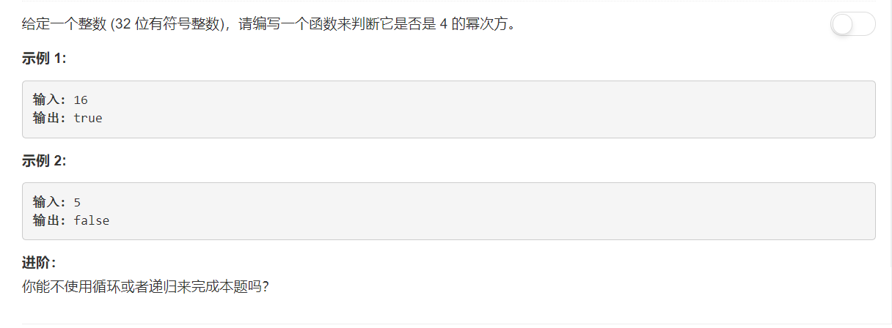

# 342 - 4的幂

## 题目描述


>关联题目： [231. 2的幂](https://github.com/Rosevil1874/LeetCode/tree/master/Python-Solution/231_Powe-of-Two)
>关联题目： [326. 4的幂](https://github.com/Rosevil1874/LeetCode/tree/master/Python-Solution/231_Powe-of-Three)


## 题解一：【除法运算】
**思路：** 最原始的方法，一直除以4。

```python
class Solution(object):
    def isPowerOfThree(self, n):
        """
        :type n: int
        :rtype: bool
        """
        if n <= 0:
            return False
            
        while n%4 == 0:
            n = n // 4
        return n == 1
```

## 题解二：【位运算】
人家题目上让不用循环或者递归解题呢，，那就考虑位运算吧。先看看4的幂的二进制表示有什么规律：

- 4：100
- 16：10000
- 64：1000000

发现都是最高位为1然后后面跟上偶数个0，其实啊就是2的幂少了奇数个0的情况。其实首先可以使用2的幂的方法把不是2的幂的情况排除掉，既然不是2的幂肯定就不是4的幂了，那剩下的怎么判断呢。网上冲浪之后找到一个神器：0x55555555，这个数的二进制形式是 **0101 0101 0101 0101 0101 0101 0101 0101**，从低到高奇数位均为1，偶数位均为0。正好4的幂低位有偶数个0，最高为为偶数位，等于1，若将4的幂和0x55555555相与，最后得到的肯定是原数。


```python
class Solution(object):
    def isPowerOfFour(self, n):
        """
        :type n: int
        :rtype: bool
        """
        if n <= 0 or (n & (n -1) != 0):
            return False
        return n & 0x55555555 == n
```

one-line:

```python
class Solution(object):
    def isPowerOfFour(self, n):
        """
        :type n: int
        :rtype: bool
        """
        return n > 0 and (n & (n -1) == 0) and (n & 0x55555555 == n)

```