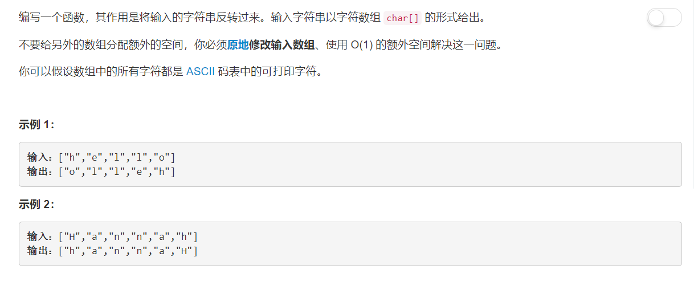

# 344 - 反转字符串

## 题目描述


>关联题目： 
[541. 反转字符串 II](https://github.com/Rosevil1874/LeetCode/tree/master/Python-Solution/541_Reverse-String-II)
[557. 反转字符串中的单词 III](https://github.com/Rosevil1874/LeetCode/tree/master/Python-Solution/557_Reverse-Words-in-a-String-III)

>题目要求：
1. 原地修改输入数组，不返回任何内容；
2. 使用 O(1) 的额外空间.

## 题解一：【按序插入】
**思路：** 以原字符串的第一个字母为基准，每次将字符串当前的最后一个字母弹出并插入到基准字母后面，遍历完一遍字符串就好啦。

```python
class Solution:
    def reverseString(self, s: List[str]) -> None:
        """
        Do not return anything, modify s in-place instead.
        """
        for i in range(len(s)):
            s.insert(i, s.pop())
```


## 题解二：【交换】
**思路：** 每次将字符串前面一半的元素与后面一半对应位置的元素交换位置。

```python
class Solution:
    def reverseString(self, s: List[str]) -> None:
        """
        Do not return anything, modify s in-place instead.
        """
        l, r = 0, len(s) - 1
        while l < r:
            s[l], s[r] = s[r], s[l]
            l += 1
            r -= 1
```