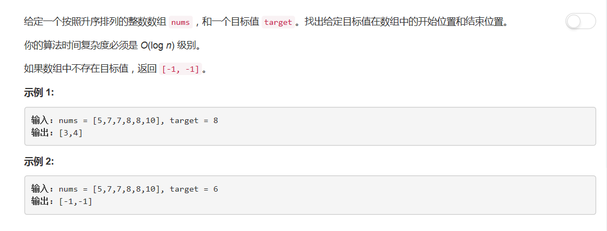

# 334 - 搜索范围

## 题目描述


>审题：
1. 返回目标索引范围，不存在则返回[-1,-1]；
2. 时间复杂度O(log n)。


## 二分查找法
>cr: [Clean iterative solution with two binary searches (with explanation)](https://leetcode.com/problems/search-for-a-range/discuss/14699/Clean-iterative-solution-with-two-binary-searches-(with-explanation))  
使用两次二分查找，一次查找左边界，一次查找右边界。

思路：
1. 查找左边界range(0, len-1)：
    1. target > nums[mid]，第一个target在mid右边[left = mid + 1]；
    2. target < nums[mid], 第一个target在mid左边[right = mid - 1]；
    3. target = nums[mid]，第一个target在mid左边[right = mid]。
    情况2,3中均需要将搜索范围往左边移动，所以可以合并。
2. 查找右边界range(left, len-1):
    1. target < nums[mid]，最后一个target在mid左边[left = mid + 1]；
    2. target > nums[mid], 最后一个target在mid右边[right = mid - 1]；
    3. target = nums[mid]，最后一个target在mid右边或者target就在mid处[right = mid]。
    情况2,3中均需要将搜索范围往右边移动，所以可以合并。

### 代码一
```python
class Solution(object):
    def searchRange(self, nums, target):
        """
        :type nums: List[int]
        :type target: int
        :rtype: List[int]
        """
        res = [-1, -1]
        if not len(nums):
            return res
        
        left, right = 0, len(nums) - 1

        # 左边界：left指针向左移动到第一个target出现的位置
        while left < right:
            mid = (left + right) // 2
            if target > nums[mid]:
                left = mid + 1
            else:
                right = mid

        # 找不到target
        if nums[left] != target:
            return res

        # 右边界：找最后一个target出现的位置
        res[0] = left
        right = len(nums) - 1
        while left < right:
            mid = (left + right) // 2 + 1   # 令mid偏向右边
            if target < nums[mid]:
                right = mid - 1
            else:
                left = mid
        res[1] = right
        return res
```

### 代码二
```python
res = [-1, -1]
if not len(nums):
    return res

left, right = 0, len(nums) - 1

# right指针向左移动到第一个target出现的位置
while left < right:
    mid = (left + right) // 2
    if target > nums[mid]:
        left = mid + 1
    else:
        right = mid

# 找不到target
if nums[right] != target:
    return res

# 找最后一个target出现的位置
res[0] = right
right = len(nums)
while left < right:
    mid = (left + right) // 2
    if target >= nums[mid]:
        left = mid + 1
    else:
        right = mid
res[1] = left - 1
return res
```