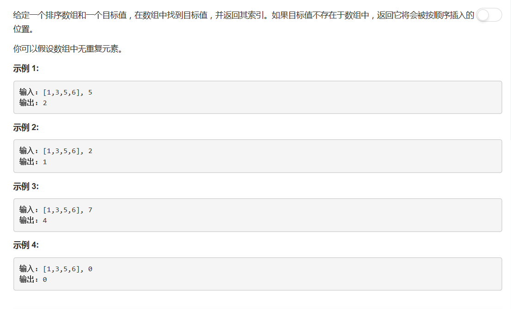

# 35 - 搜索插入位置

## 题目描述



## 最蠢的办法
**依次遍历：时间复杂度O(n)**

1. 若数组长度为0， 返回-1；
2. 一次向后遍历，对每一个元素，若其大于等于target，返回当前坐标；
	1. 当元素等于target，此时找到target在数组中的坐标，返回；
	2. 当元素大于target，此时应当把target插入此元素的位置，后面的元素依次后移一位。
3. 若最后一个元素小于target，返回length，即应当插入数组末尾。

以为会超时，然而并没有哈哈哈哈✧*｡٩(ˊᗜˋ*)و✧\*｡

```python
class Solution(object):
    def searchInsert(self, nums, target):
        """
        :type nums: List[int]
        :type target: int
        :rtype: int
        """
        l = len(nums)
        if not l:
        	return-1

        for i in range(l):
        	if nums[i] >= target:
        		return i
        if nums[l-1] < target:
        	return l
        return -1
```

## 二分查找
**时间复杂度O(log n)**

```python
class Solution(object):
    def searchInsert(self, nums, target):
        """
        :type nums: List[int]
        :type target: int
        :rtype: int
        """
        left = 0
        right = len(nums) - 1

        while left <= right:
        	mid = (left + right) // 2
        	if target < nums[mid]:
        		right = mid - 1
        	elif target > nums[mid]:
        		left = mid + 1
        	else:
        		return mid

        return left
```