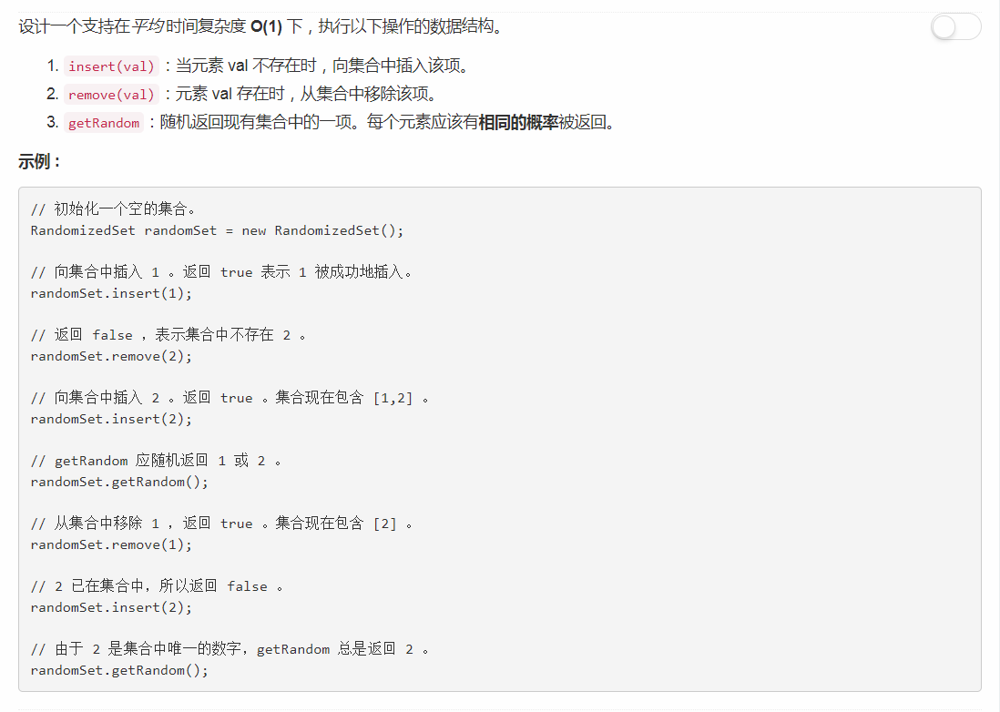

# 380 - 常数时间插入、删除和获取随机元素

## 题目描述


>关联题目： [381. O(1) 时间插入、删除和获取随机元素 - 允许重复](https://github.com/Rosevil1874/LeetCode/tree/master/Python-Solution/381_Insert-Delete-GetRandom-O(1)-Duplicates-allowed)  

## 题解
看到class就束手无策的蠢蛋本人，参考agave同学的思路：  
>We just keep track of the index of the added elements, so when we remove them, we copy the last one into it.  
1. list.append() takes O(1), both average and amortized.   
2. Dictionary get and set functions take O(1) average

list操作的时间复杂度如下：  


1. 插入：  
append时间复杂度为O(1)，只需在插入元素的同时使用字典pos记录其位置即可。

2. 删除：  
由于del的时间复杂度为O(N)，因此需要将末尾元素交换到待删除元素位置并更新其pos，再使用时间复杂度为O(1)的pop操作将其删除。

3. 随机元素：  
random模块：
```python
random.randint(1,10)         # 产生 1 到 10 的一个整数型随机数  
random.random()              # 产生 0 到 1 之间的随机浮点数
random.uniform(1.1,5.4)      # 产生  1.1 到 5.4 之间的随机浮点数，区间可以不是整数
random.choice('tomorrow')    # 从序列中随机选取一个元素
random.randrange(1,100,2)    # 生成从1到100的间隔为2的随机整数

a=[1,3,5,6,7]                # 将序列a中的元素顺序打乱
random.shuffle(a)
```

好了，AC代码如下：
```python
class RandomizedSet:

    def __init__(self):
        """
        Initialize your data structure here.
        """
        self.nums = []
        self.pos = {}
        

    def insert(self, val):
        """
        Inserts a value to the set. Returns true if the set did not already contain the specified element.
        :type val: int
        :rtype: bool
        """
        if val not in self.pos:
        	self.nums.append(val)
        	self.pos[val] = len(self.nums) - 1
        	return True
        return False
        
    def remove(self, val):
        """
        Removes a value from the set. Returns true if the set contained the specified element.
        :type val: int
        :rtype: bool
        """
        if val in self.pos:
        	idx = self.pos[val]
        	last = self.nums[-1]
        	self.nums[idx] = last
        	self.pos[last] = idx
        	self.nums.pop()
        	self.pos.pop(val, 0)
        	return True
        return False

    def getRandom(self):
        """
        Get a random element from the set.
        :rtype: int
        """
        return self.nums[random.randint(0, len(self.nums) - 1)]
```