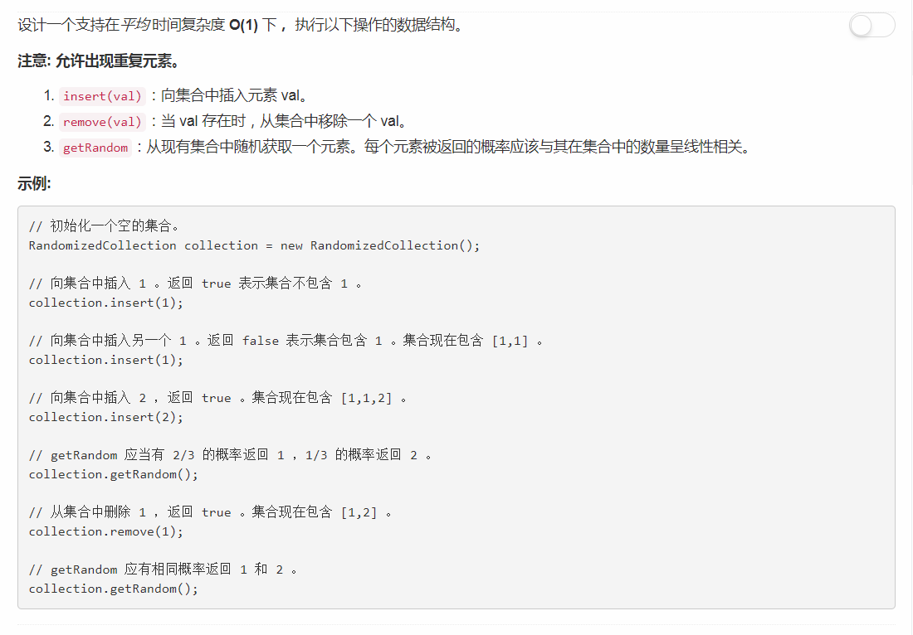

# 381 - O(1) 时间插入、删除和获取随机元素 - 允许重复

## 题目描述


>关联题目： [380. 常数时间插入、删除和获取随机元素](https://github.com/Rosevil1874/LeetCode/tree/master/Python-Solution/380_Insert-Delete-GetRandom-O(1))  

## 题解
同样参考agave同学的思路：  
和380题唯一的区别就是允许重复元素，操作的实现都大同小异。不过沿用dict来存储元素索引的话，删除的时候值相同的不同下标元素会被一下子全删掉，所以用了collection模块。  
1. `collection.defaultdict(set)`: 创建一个类似dictionary对象，里面任何的values都是set的实例，而且就算是一个不存在的key，也有一个默认值，这个默认值是空的set{}。
2. `set.discard()`: 如果存在元素，就删除；没有不报异常
```python
import collections
class RandomizedCollection(object):

    def __init__(self):
        self.vals, self.idxs = [], collections.defaultdict(set)
        

    def insert(self, val):
        self.vals.append(val)
        self.idxs[val].add(len(self.vals) - 1)
        return len(self.idxs[val]) == 1
        

    def remove(self, val):
        if self.idxs[val]:
            out, ins = self.idxs[val].pop(), self.vals[-1]
            self.vals[out] = ins
            if self.idxs[ins]:
                self.idxs[ins].add(out)
                self.idxs[ins].discard(len(self.vals) - 1)
            self.vals.pop()
            return True
        return False 

    def getRandom(self):
        return random.choice(self.vals)
```