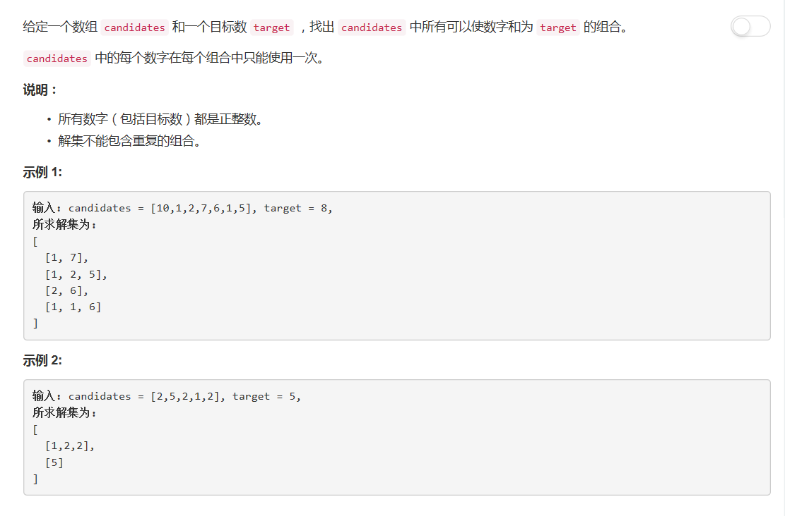

# 40 - 组合总和 II

## 题目描述


>审题：  
1. 相同元素**不可以**重复使用，与39题唯一的区别；
2. 解集不包含重复解；
3. 这是n-sum，不是之前的two-sum、three-sum、four-sum，不能用循环。

## 回溯法

1. 排序，每次加入一个最小值；
2. 将remain = target-sum(tmp)作为参数进行递归，避免每次计算解中元素的和；
3. 若remain < 0，则表示解中元素的和比target大，从解中pop最后一个元素；
4. 若remain == 0，则找到一个解；
5. 使用set过滤重复解。

```python
class Solution(object):
    def combinationSum2(self, candidates, target):
        """
        :type candidates: List[int]
        :type target: int
        :rtype: List[List[int]]
        """
        res = set()
        candidates.sort()
        self.backtrack(res, [], candidates, target, 0)
        return list( map(list, res) )

    def backtrack(self, res, tmp, candidates, remain, start):
        if remain < 0:
            return
        elif remain == 0:
            res.add(tuple(tmp))
        else:
            for i in range(start, len(candidates)):
                if candidates[i] > remain:      # 剪枝
                    break
                # tmp.append(candidates[i])     # tmp按引用传递，直接这样append会导致最后res中的解全部是最后一个tmp的值
                self.backtrack(res, tmp + [candidates[i]], candidates, remain - candidates[i], i+1) #不可以重复使用同一元素，start递增

```

## 小tip
1. set和dict很像，唯一区别是不存储value；
2. set的元素必须是不变对象；
3. 使用set过滤重复数组时，由于list是可变对象，不能作为set的元素，可以先将其转化为不变的tuple,最后再依次转换回list。
