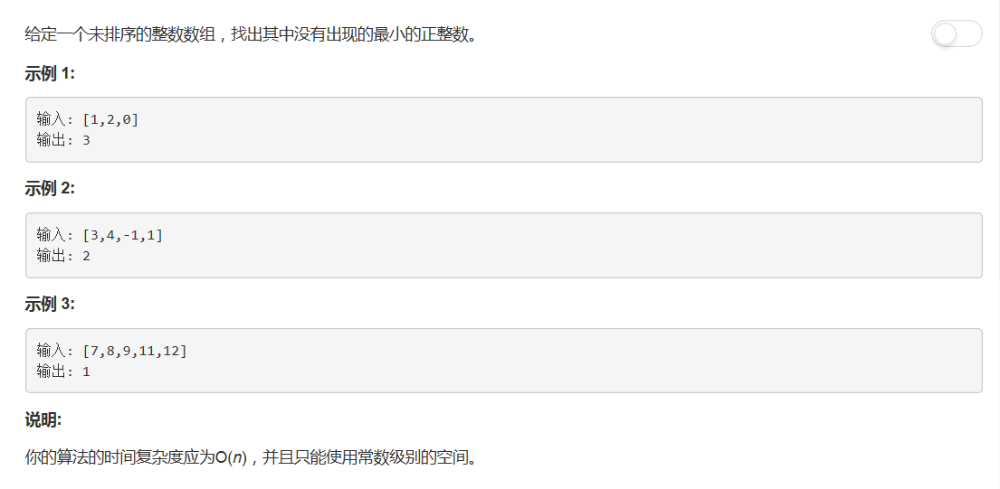

# 41 - 缺失的第一个正数

## 题目描述


>审题：  
1. 时间复杂度O(n);
2. 常数级别的空间;
3. **正**整数：从1开始啊哥；
4. 题目说了未排序，肯定就是让你在不排序的情况下找出题解啊是吧|･ω･｀)

## 题解一
>我自己的思路就不好意思说了，简直叫没有思路。。。这里参照了这个解答 :[Share my O(n) time, O(1) space solution](https://leetcode.com/problems/first-missing-positive/discuss/17073/Share-my-O(n)-time-O(1)-space-solution)  
原解答中有这样一段： The basic idea is **for any k positive numbers (duplicates allowed), the first missing positive number must be within [1,k+1]**. The reason is like you put k balls into k+1 bins, there must be a bin empty, the empty bin can be viewed as the missing number.

1. 首先排除负数（不满足“正整数”），其次排除值大于数组长度的元素（不满足“最小”）；
2. 排除以上元素后，用剩余的每个值建立一个hash表，每个元素放入hash表中下标为（值 - 1）的位置；
3. 从头遍历hash表（隐式升序排列），若表中某个位置为空，则找到了缺失的最小正整数。

```python
class Solution:
    def firstMissingPositive(self, nums: List[int]) -> int:
        n = len(nums)
        hashmap = [0]*n
        
        for x in nums:
            if x > 0 and x <= n:
                hashmap[x - 1] = x
                
        for i in range(n):
            if hashmap[i] != i + 1:
                return i + 1
        
        return n + 1
```

## 题解二
>此解思路与解一类似，只是不适用额外空间建立hash表，而是原地交换：  
把每个值换到原数组中对应下标的位置，把原数组变成一个hash表，最后遍历的是原数组。

```python
class Solution:
    def firstMissingPositive(self, nums: List[int]) -> int:
        n = len(nums)

        for i in range(n):
            while nums[i] > 0 and nums[i] <= n and nums[nums[i] - 1] != nums[i]:
                nums[nums[i] - 1], nums[i] = nums[i], nums[nums[i] - 1]

        for i in range(n):
            if nums[i] != i + 1:
                return i + 1

        return n + 1
```