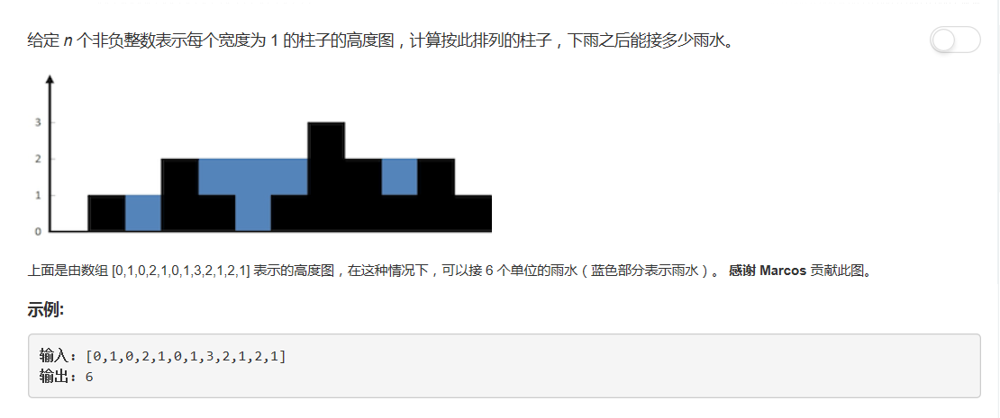

# 42 - 接雨水

## 题目描述


>审题：  
1. 面积计算；
2. 短板效应。

## 题解

>思路：
1. 以逐个累计的方式替代长×宽的方式；
2. 从左往右记录一个最高点，若其右的值大于它，即为新的最高点，否则可以将其面积计入；
3. 从右往左记录一个最高点，若其左的值大于它，即为新的最高点，否则可以将其面积计入；
4. 左右指针相遇结束算法。

```python
class Solution(object):
    def trap(self, height):
        """
        :type height: List[int]
        :rtype: int
        """
        n = len(height)
        maxArea = area = 0

        left = 0
        right = n - 1
        res = 0
        maxLeft = maxRight = 0
        while left <= right:
            if height[left] <= height[right]:
                if height[left] >= maxLeft:
                    maxLeft = height[left]
                else:
                    res += (maxLeft - height[left])
                left += 1
            else:
                if height[right] >= maxRight:
                    maxRight = height[right]
                else:
                    res += (maxRight - height[right])
                right -= 1

        return res
```
## 简化代码
```python
class Solution(object):
    def trap(self, height):
        """
        :type height: List[int]
        :rtype: int
        """
        n = len(height)
        maxArea = area = 0

        left = 0
        right = n - 1
        res = 0
        maxLeft = maxRight = 0
        while left <= right:
            maxLeft = max(maxLeft, height[left])
            maxRight = max(maxRight, height[right])
            if maxLeft < maxRight:
                res += (maxLeft - height[left])
                left += 1
            else:
                res += (maxRight - height[right])
                right -= 1

        return res
```