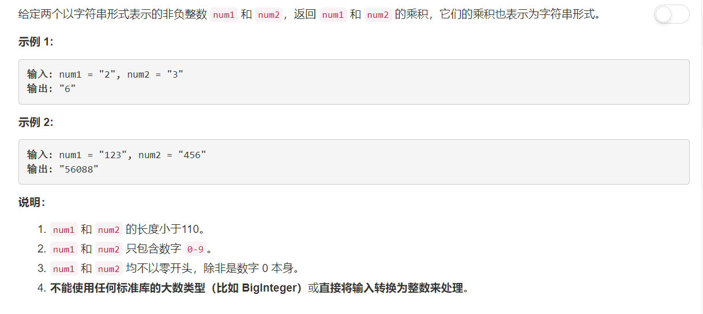

# 43 - 字符串相乘

## 题目描述


>审题：  
1. 手工乘法
2. 不能直接将字符串转化成数字。

## 题解

>**注意：** 
1. 手工乘法；
2. 处理0\*0的情况；
3. 最后将结果数组前面的0去掉再结合成字符串返回。

```python
class Solution(object):
    def multiply(self, num1, num2):
        """
        :type num1: str
        :type num2: str
        :rtype: str
        """
        if num1 == '0' or num2 == '0':
        	return '0'

        product = [0] * (len(num1) + len(num2))
        pos = len(product) - 1
        for a in reversed(num1):
        	tempPos = pos
        	for b in reversed(num2):
        		product[tempPos] += int(a) * int(b)
        		product[tempPos - 1] += product[tempPos]//10
        		product[tempPos] %= 10
        		tempPos -= 1
        	pos -= 1

        pt = 0
        while pt < len(product) - 1 and product[pt] == 0:
        	pt += 1

        return ''.join(map(str, product[pt:]))
```
