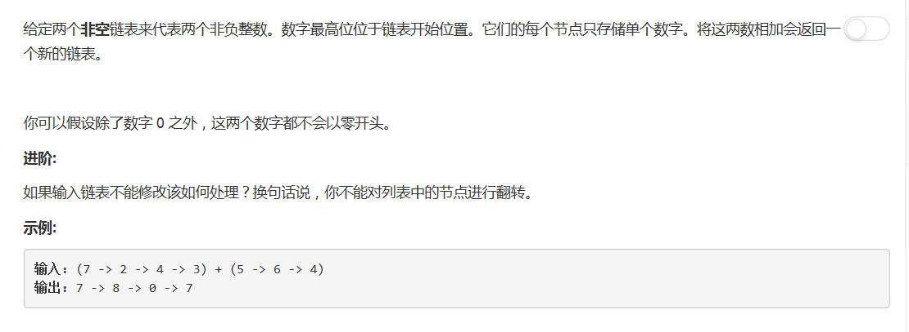

# 445 - 两数相加 II

## 题目描述


>审题：
emmm这个和第二题是相似题目，只是第二题的数字是低位在前的，思路也大同小异。
传送门 → [2.两数相加](https://github.com/Rosevil1874/LeetCode/tree/master/Python-Solution/2_Add_Two_Numbers)

## 【链表->数字->链表】
思路一：
1. 类型转化：链表->字符串->数字，数字->字符串->链表；
2. 分别将两个加数链表化为数字相加；
3. 将和化为链表返回。

```python
# Definition for singly-linked list.
# class ListNode(object):
#     def __init__(self, x):
#         self.val = x
#         self.next = None

class Solution(object):
    def addTwoNumbers(self, l1, l2):
        """
        :type l1: ListNode
        :type l2: ListNode
        :rtype: ListNode
        """
        # 求和
        num1 = int( self.LinkedListToStr(l1) )
        num2 = int( self.LinkedListToStr(l2) )
        the_sum = str( num1 + num2 )

        # 转链表
        res = p = ListNode( the_sum[0] )
        for i in range( 1, len(the_sum) ):
            p.next = ListNode(the_sum[i])
            p = p.next
        return res

    def LinkedListToStr(self, head):
        s = ''
        while head:
            s += str(head.val)
            head = head.next
        return s
```

## 【加法进位】
>既然题目里面提到了链表反转，那还是用这个方法试一下吧。(〃ﾉωﾉ)

1. 将链表反转至低位在前；
2. 从头遍历两个链表，按位相加并存储进位；

```python
class Solution(object):
    def addTwoNumbers(self, l1, l2):
        """
        :type l1: ListNode
        :type l2: ListNode
        :rtype: ListNode
        """
        l1 = self.reverseList( l1 )
        l2 = self.reverseList( l2 )

        head = ListNode(None)
        curr = head
        carry = 0       # 进位
        while l1 or l2 or carry != 0:
            num = ( l1.val if l1 else 0 ) + ( l2.val if l2 else 0 ) + carry
            carry = num // 10
            curr.next = ListNode(num % 10)
            curr = curr.next
            l1 = l1.next if l1 else l1
            l2 = l2.next if l2 else l2
        return self.reverseList(head.next)
        
    # 反转链表
    def reverseList(self, head):
        if not head or not head.next:
            return head

        curr = head
        while curr.next:
            tmp = ListNode(curr.next.val)
            tmp.next = head
            head = tmp
            curr.next = curr.next.next
        return tmp
```
