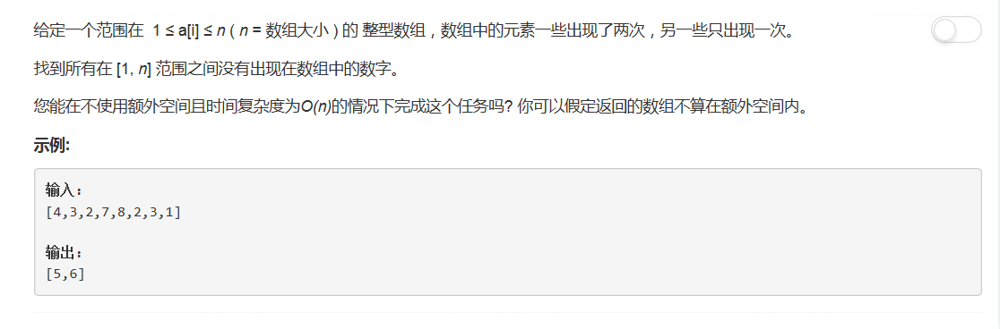

# 448 - 找到所有数组中消失的数字

## 题目描述


>关联题目[442 数组中重复的数据](https://github.com/Rosevil1874/LeetCode/tree/master/Python-Solution/442_Find-All-Duplicates-in-an-Array)

## 题解一
**时间复杂度O(1), 空间复杂度O(N)**
>我的第一次一行代码解题哈哈哈哈哈✧*｡٩(ˊᗜˋ*)و✧\*｡
```python
class Solution(object):
    def findDisappearedNumbers(self, nums):
        """
        :type nums: List[int]
        :rtype: List[int]
        """
        return list ( set([i + 1 for i in range(len(nums))]) - set(nums) )
```

## 题解二
**时间复杂度O(N), 空间复杂度O(1)**
>cr: [Java accepted simple solution](https://leetcode.com/problems/find-all-numbers-disappeared-in-an-array/discuss/92956/Java-accepted-simple-solution)  

思路：  
1. 遍历数组，将每个数减一作为索引，将该位置的数改为负数；
2. 再次遍历数组，若某位置上的数还是正数，说明原数组中没有（此索引+1）这个数。
```python
class Solution(object):
    def findDisappearedNumbers(self, nums):
        """
        :type nums: List[int]
        :rtype: List[int]
        """
        for i in range(len(nums)):
            idx = abs(nums[i]) - 1
            nums[idx] = -abs( nums[idx] )
        return [i + 1 for i in range(len(nums)) if nums[i] > 0]
```