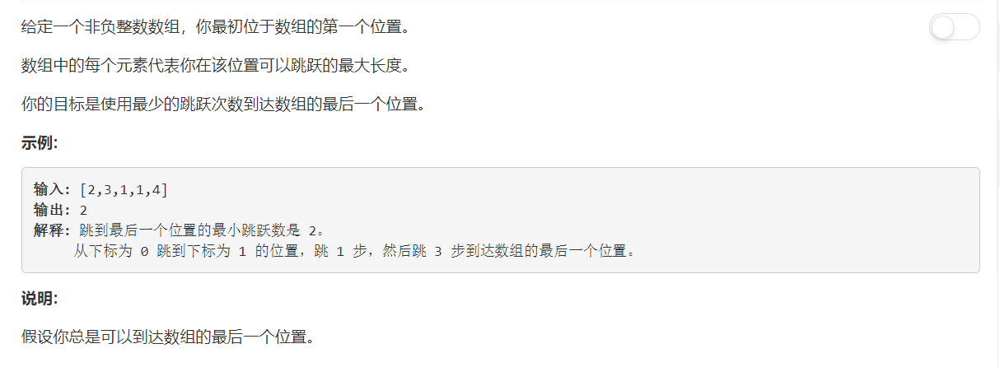
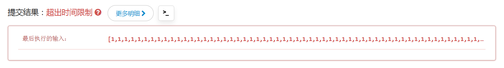

# 45 - 跳跃游戏II

## 题目描述


>关联题目：[55. 跳跃游戏](https://github.com/Rosevil1874/LeetCode/tree/master/Python-Solution/55_Jump-Game)

## 题解一

思路：
1. 从最后一个位置开始从后往前判断，记录最靠前的一个能跳到当前位置的数；
2. 找到后向前跳这个力所能及的最大距离，且步数加一。

```python
class Solution(object):
    def jump(self, nums):
        """
        :type nums: List[int]
        :rtype: int
        """
        n = len(nums)
        last = n - 1
        count = 0
        while last > 0:
            prev = last
            i = last - 1
            while i >= 0:
                if nums[i] >= last - i:
                    prev = i
                i -= 1
            last = prev
            count += 1
        return count

```

**超时：**  
思路是对的，可惜两重循环超时没跑的༼༎ຶᴗ༎ຶ༽


## 题解二
>自己的思路不行就去看看别人的了。这个思路和我的其实差不多，只不过是从前往后的，就不需要两重循环了，我还以为从前往后行不通呢哎为什么不试一下呢。
cr: [【LeetCode】45. Jump Game II](http://www.cnblogs.com/ganganloveu/p/3761715.html)

变量说明：
- count:目前为止的jump数
- curRch:从A[0]进行ret次jump之后达到的最大范围
- curMax:从0~i这i+1个A元素中能达到的最大范围
- **当curRch < i**，说明count次jump已经不足以覆盖当前第i个元素，因此需要增加一次jump，使之达到记录的curMax。

```python
class Solution(object):
    def jump(self, nums):
        """
        :type nums: List[int]
        :rtype: int
        """
        n = len(nums)
        curMax = 0
        curRch = 0
        count = 0
        for i in range(n):
            if curRch < i:
                count += 1
                curRch = curMax
            curMax = max(curMax, i + nums[i])
        return count
```