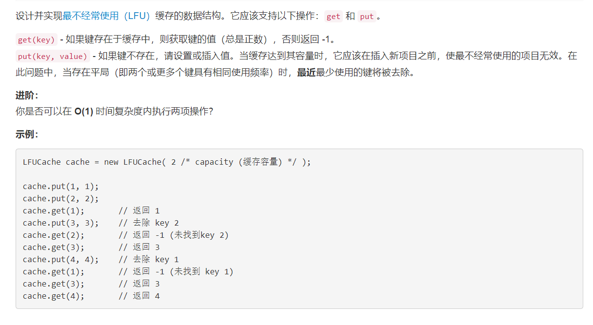

# 460 - LFU缓存

## 题目描述


>关联题目： [146. LRU缓存机制](https://github.com/Rosevil1874/LeetCode/tree/master/Python-Solution/146_LRU-Cache)。  
关键区别在于： 在此问题中，当存在平局（即两个或更多个键具有相同使用频率）时，最近最少使用的键将被去除。


## 题解：【OrderedDict】

ref:[Python only use OrderedDict](https://leetcode.com/problems/lfu-cache/discuss/166683/Python-only-use-OrderedDict-get-O(1)-put-O(1)-Simple-and-Brief-Explained!!!!!!)

**思路：**
1. collections.OrderedDict():可以记住内容添加顺序的字典。  特殊方法：OrderedDict.popitem(last=True) 。last为True是LIFO,即为堆栈，反之是FIFO，即为队列；
2. 不管get还是set之后，操作的这个元素都要拿出来重新放进去，表示现在使用了它；
3. 变量：
	- node:数据节点，包含属性key,val,count；
	- key2node: 每个key对应的node；
	- count2node：一个OrderedDict的dict，保存出现次数分别的node集合。如count2node[count]表示出现count次的key集合，其中的key按加入顺序排列，count2node[count][key]表示出现count次的key对应的node；
	- minCount:出现的最小次数（不关心是哪个key)

>两个操作时间复杂度都是O(1)哟~

```python
from collections import defaultdict
from collections import OrderedDict

class Node():
	def __init__(self, key, val, count):
		self.key = key
		self.val = val
		self.count = count

class LFUCache(object):

    def __init__(self, capacity):
        """
        :type capacity: int
        """
        self.capacity = capacity
        self.key2node = {}
        self.count2node = defaultdict(OrderedDict)
        self.minCount = None

    def get(self, key):
        """
        :type key: int
        :rtype: int
        """
        # 缓存中没有这个key
        if key not in self.key2node:
        	return -1

        # 获取这个key对应的node，更新key对应的count：
        # 删掉当前count中key对应的数据
        node = self.key2node[key]
        del self.count2node[node.count][key]

        # clean memory
        if not self.count2node[node.count]:
        	del self.count2node[node.count]

		# get操作后count加1
        node.count += 1
        self.count2node[node.count][key] = node

        # 若key本来对应minCount，那get之后minCount也需要更新
        if not self.count2node[self.minCount]:
        	self.minCount += 1

        return node.val


        

    def put(self, key, value):
        """
        :type key: int
        :type value: int
        :rtype: None
        """
        if self.capacity == 0:
        	return 
        	
        # key已经在缓存中了，就相当于get（使用）一次，同时更新val
        if key in self.key2node:
        	self.key2node[key].val = value
        	self.get(key)
        	return

        # 如果key不在缓存中，且缓存已满，则删掉最近最少使用的
        if len(self.key2node) == self.capacity:
        	k, v = self.count2node[self.minCount].popitem(last = False)
        	del self.key2node[k]  

        # 添加新node
        self.count2node[1][key] = self.key2node[key] = Node(key, value, 1)      
        self.minCount = 1
        return


# Your LFUCache object will be instantiated and called as such:
# obj = LFUCache(capacity)
# param_1 = obj.get(key)
# obj.put(key,value)
```