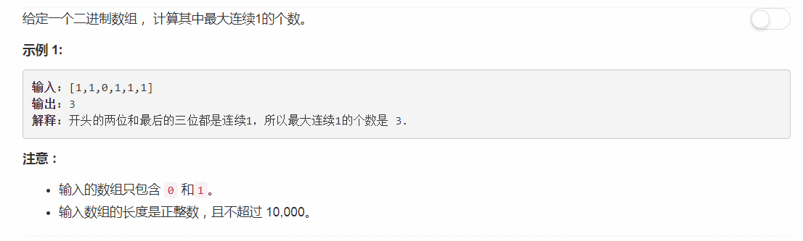

# 485 - 最大连续1的个数

## 题目描述


## 遍历计数
**时间复杂度O(N)**
```python
class Solution:
    def findMaxConsecutiveOnes(self, nums):
        """
        :type nums: List[int]
        :rtype: int
        """
        maxLen = 0
        cnt = 0
        for i in range(len(nums)):
            if nums[i] == 1:
                cnt += 1
                maxLen = max(maxLen, cnt)
            else:
                cnt = 0
        return maxLen
```
