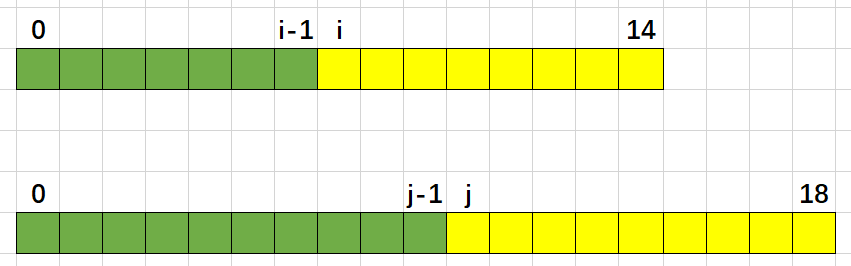

## 题目描述


<!-- more -->

## 方法一：先合并
思路：
1. 合并两个有序数组；
2. 排序；
3. 找中位数；
4. but 这样的话原本的数组有不有序又有什么关系呢。。。
5. 时间复杂度O(m+n)

```python
class Solution:
    def findMedianSortedArrays(self, nums1, nums2):
        """
        :type nums1: List[int]
        :type nums2: List[int]
        :rtype: float
        """
        m = len(nums1)
        n = len(nums2)
        nums1.extend(nums2)
        nums1 = sorted( nums1 )
        l = len(nums1)
        if l % 2 == 1:
        	return nums1[l//2]
        else:
        	return ( nums1[l//2-1] + nums1[l//2] ) / 2
```

## 方法二：二分查找
> cr:[两个有序数组的中位数（Hard）](https://mzi.red/2017/12/04/leetcode-4/)

**不太懂，还是迷迷糊糊的，谁来救救我呀啊啊啊**

思路：
这里得提到中位数的性质，在有序的有限数集中，在中位数左边的数的个数与右边的相等。也就是说这个问题可以进一步转化为在nums1数组抽前i个数在nums2数组中抽前j个数，且
i+j==halflen,(halflen=(m+n+1)/2)（在奇数情况下左边的数比右边多一个）。所以我们只要二分查找i，通过等式得到
j=halflen−i，然后判断是否能满足中位数的条件。
为了方便起见，同时减少运算次数，我们把数组size小的放到nums1，大的放到nums2，然后从nums1中查找i。
进一步缩小查找范围？对于任意取的值i，我们能得到下面这张图中的关系。绿色的代表左边的数字，黄色的代表的是右边的数字。


```python
class Solution:
    def findMedianSortedArrays(self, nums1, nums2):
        """
        :type nums1: List[int]
        :type nums2: List[int]
        :rtype: float
        """
        m = len(nums1)
        n = len(nums2)

        # 根据数组大小交换顺序，小的在前
        # tmpn = 0
        # tmparr = []
        if m > n:
        	tmpn = m
        	m = n
        	n = tmpn
        	tmparr = nums1
        	nums1 = nums2
        	nums2 = tmparr

        imin = 0
        imax = m
        half_len = (m + n + 1)//2

        # 二分查找i值
        while imin <= imax:
        	i = (imin + imax) // 2
        	j = half_len - i
        	if i < m and nums2[j - 1] > nums1[i] :
        		imin = i + 1
        	elif i > 0 and nums1[i - 1] > nums2[j] :
        		imax = i - 1
        	else:
        		# 左边最大值
        		if not i:
        			max_of_left = nums2[j-1]
        		elif not j:
        			max_of_left = nums1[i-1]
        		else:
        			max_of_left = max(nums1[i-1], nums2[j-1])
        		# 如果总为奇数直接返回左边最大值
        		if (m + n)%2 == 1:
        			return max_of_left
        		# 右边最小值
        		if i == m:
        			min_of_right = nums2[j]
        		elif j == n:
        			min_of_right = nums1[i]
        		else:
        			min_of_right = min(nums1[i], nums2[j])
        		return (max_of_left + min_of_right) / 2
        return 0
```