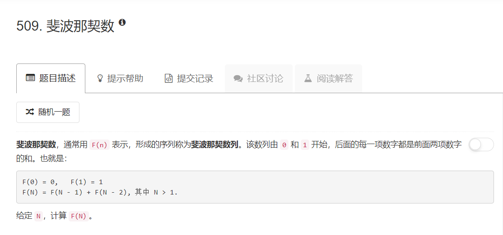
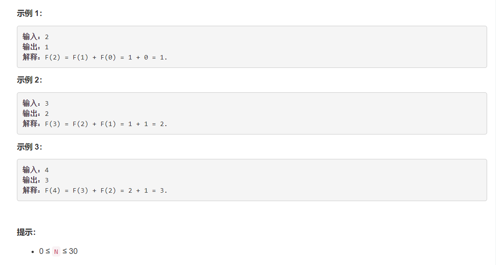

# 509 - 斐波那契数列

## 题目描述



## 题解一
思路：  简单粗暴按照定义递归，希望不要超时。。。

```python
class Solution:
    def fib(self, N: int) -> int:
    	if N <= 1:
    		return N
    	else:
    		return self.fib(N - 1) + self.fib(N - 2)

```

## 题解二
思路：仍然简单粗暴，迭代，希望不要超时。。。

```python
class Solution:
    def fib(self, N: int) -> int:
    	a, b = 0, 1

    	for i in range(N):
    		a, b = b, a + b
    	return a
```

竟然都通过了哈哈哈哈，何等低级的解答，我要去看看大神了，抄过来抄过来。。。。
十分钟后：我回来啦！emmmmm也许这题就是这么简单粗暴吧嘻嘻。