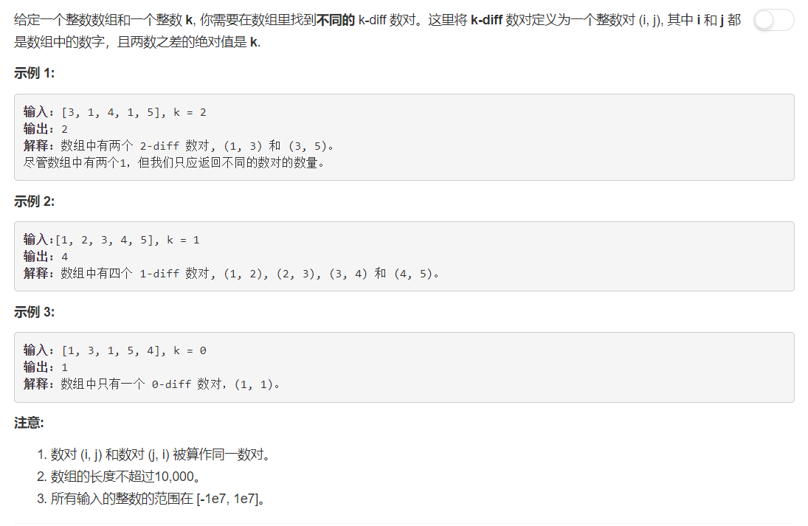

# 532 - 数组中的K-diff数对

## 题目描述



### 题解：
**思路**  
1. 当k < 0，没有这样的k-diff数对；
2. 当k == 0， 出现至少两次的数自身构成k-diff数对；
3. 当k > 0， x 与 x + k 构成k-diff数对。

```python
class Solution:
    def findDuplicates(self, nums):
        """
        :type nums: List[int]
        :rtype: List[int]
        """
        res = []

        for x in nums:
        	nums[x - 1] = - nums[x - 1]

        for i in range(len(nums)):
        	if nums[i] >= 0:
        		res.append(i + 1)

        return res
```