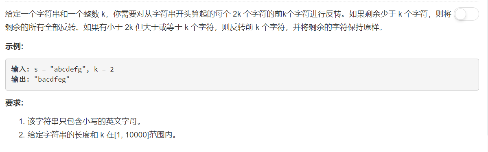

# 541 - 反转字符串 II

## 题目描述


>关联题目： 
[344. 反转字符串](https://github.com/Rosevil1874/LeetCode/tree/master/Python-Solution/344_Reverse-String)


## 题解一：【按序插入】
**思路：** 以原字符串的最后一个字母为基准，每次将字符串当前的第一个字母插入到基准字母后面，遍历完一遍字符串就好啦。

```python
class Solution(object):
    def reverseString(self, s):
        """
        :type s: List[str]
        :rtype: None Do not return anything, modify s in-place instead.
        """
        i = len(s) - 1
        while i > 0:
            x = s.pop(0)
            s.insert(i, x)
            i -= 1
```

`return bool(n % 4 != 0)`这一句还可以简化成`return  n % 4 != 0`或者`return n % 4`都是可以哒！  
还有同一个思路，用位运算实现的，会比模运算快一点：

```python
class Solution(object):
    def canWinNim(self, n):
        """
        :type n: int
        :rtype: bool
        """
        return bool( n & 3 != 0 )
```


## 题解二：【交换】
**思路：** 
1. 先实现一个转换整个字符串的函数；
2. 每次将字符串每2k个字符串中的前k个反转；
3. 将剩下的不足k个的字符串反转。

```python
class Solution(object):
    def reverseString(self, s):
        """
        :type s: List[str]
        :rtype: None Do not return anything, modify s in-place instead.
        """
        i, j = 0, len(s) - 1
        while i < j:
            s[i], s[j] = s[j], s[i]
            i += 1
            j -= 1
```