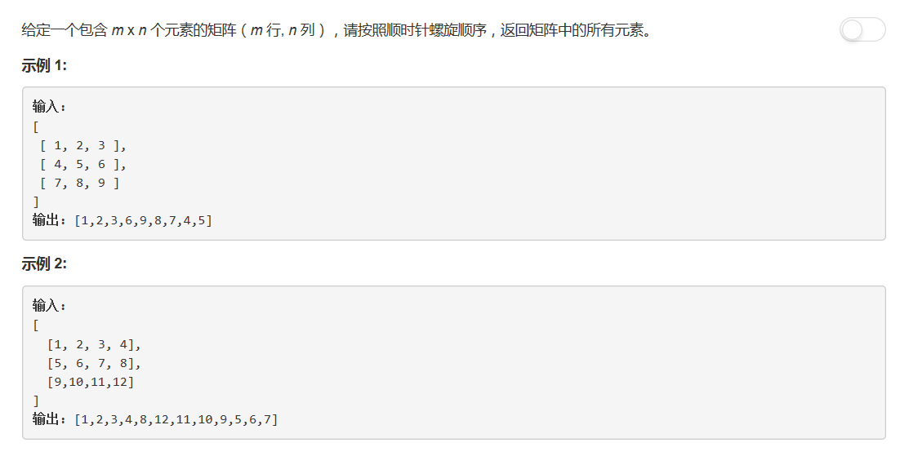

# 54 - 螺旋矩阵

## 题目描述


>关联题目：[59. 螺旋矩阵II](https://github.com/Rosevil1874/LeetCode/tree/master/Python-Solution/59_Spiral-Matrix-II)

## 解法一
>按照螺旋形状寻找规律遍历。

思路：
1. 分别找到行列起止点rowBegin, rowEnd, colBegin, colEnd；
2. 向右遍历后rowBegin++，向下遍历后colEnd--，向左遍历后rowEnd--，向上遍历后colBegin++；
3. 直到行、列的起止点相遇；
4. 注意向左和向上遍历时需要检查此元素是否已经遍历过。

```python
class Solution:
    def spiralOrder(self, matrix: List[List[int]]) -> List[int]:
        m = len(matrix)
        if m == 0:
            return []
        
        res = []
        n = len(matrix[0])
        row_begin, row_end = 0, m - 1
        col_begin, col_end = 0, n - 1
        while row_begin <= row_end and col_begin <= col_end:
            # 向右
            for j in range(col_begin, col_end + 1):
                res.append(matrix[row_begin][j])
            row_begin += 1
            
            # 向下
            for i in range(row_begin, row_end + 1):
                res.append(matrix[i][col_end])
            col_end -= 1
            
            # 向左
            j = col_end
            while j >= col_begin and row_begin <= row_end:
                res.append(matrix[row_end][j])
                j -= 1
            row_end -= 1
            
            # 向上
            i = row_end
            while i >= row_begin and col_begin <= col_end:
                res.append(matrix[i][col_begin])
                i -= 1
            col_begin += 1
        return res
```

## 解法二
矩阵操作
1. 转置： `list ( map(list, zip(*matrix)) )`
2. 反转： matrix.reverse()

>由于刚接触python，对这些基本结构的操作都不怎么了解，所以此方法是参考： [DP-solution-and-some-thoughts](https://leetcode.com/problems/maximum-subarray/discuss/20193/DP-solution-and-some-thoughts)。不足之处在于题意是按螺旋遍历，矩阵不变，而此解虽然非常取巧却把整个矩阵都删了。

思路：
1. 将矩阵第一行加入结果数组并删除；
2. 将矩阵转置并反转，就将最后一列翻转到了第一行；
3. 循环进行前两步。

```python
class Solution:
    def spiralOrder(self, matrix: List[List[int]]) -> List[int]:
        if len(matrix) == 1:
            return matrix[0]
        
        res = []
        while len(matrix) > 0:
            res += matrix[0]
            del matrix[0]
            matrix = list(map(list, zip(*matrix)))
            matrix.reverse()
        return res
```
