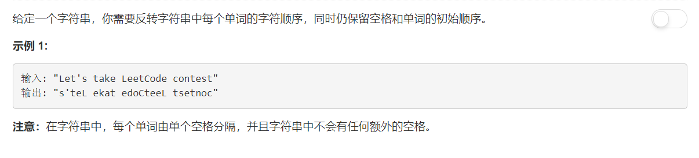

# 557 - 反转字符串中的单词 III

## 题目描述


>关联题目： 
[344. 反转字符串](https://github.com/Rosevil1874/LeetCode/tree/master/Python-Solution/344_Reverse-String)
[541. 反转字符串 II](https://github.com/Rosevil1874/LeetCode/tree/master/Python-Solution/541_Reverse-String-II)


## 题解一：
**思路：** 按每个单词分成子序列分别反转，最后连接起来。

```python
class Solution(object):
    def reverseWords(self, s):
        """
        :type s: str
        :rtype: str
        """
        words = s.split(' ')
        reversedWords = []
        for word in words:
            word = word[::-1]
            reversedWords.append(word)
        return (' ').join(reversedWords)
```
