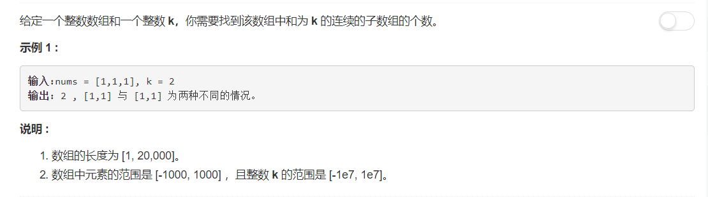
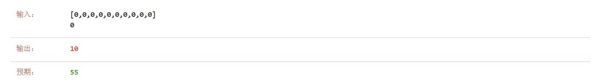

# 560 -  和为K的子数组

## 题目描述



### 第一次尝试：
试了一下自己也觉得肯定会超时的暴力法，没想到不仅仅是超时。。根本就不对，因为自己只考虑了一旦和为k就收手，并没有考虑到0的情况。

```python
class Solution:
    def subarraySum(self, nums, k):
        """
        :type nums: List[int]
        :type k: int
        :rtype: int
        """
        cnt = 0
        nums_set = set(nums)     #自动排序、去重
        for i in range( len(nums) ):
            the_sum = nums[i]
            if the_sum == k:
                cnt += 1
                continue
            for j in range( i + 1, len(nums) ):
                the_sum += nums[j]
                if the_sum == k:
                    cnt += 1
                    break
        return cnt
```
error如下：



### hash表
emmm相关话题里面有个hash表，但是想不到应该怎么hash。于是又偷偷潜入discuss区哈哈哈，shawngao的解答[Java Solution, PreSum + HashMap](https://leetcode.com/problems/subarray-sum-equals-k/discuss/102106/Java-Solution-PreSum-+-HashMap)是这样分析的：  
> We know the key to solve this problem is SUM[i, j]. So if we know SUM[0, i - 1] and SUM[0, j], then we can easily get SUM[i, j]. To achieve this, we just need to go through the array, calculate the current sum and save number of all seen PreSum to a HashMap. Time complexity O(n), Space complexity O(n).
```python
class Solution:
    def subarraySum(self, nums, k):
        """
        :type nums: List[int]
        :type k: int
        :rtype: int
        """
        cnt = 0
        theSum = 0
        preSum = {0:1}
        for x in nums:
            theSum += x
            cnt += preSum.get(theSum - k, 0)
            preSum[theSum] = preSum.get(theSum, 0) + 1
        return cnt
```