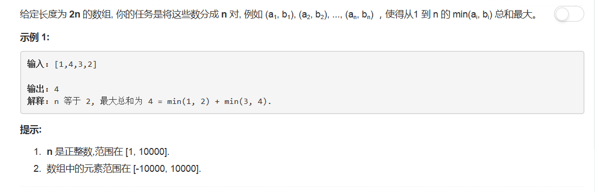

# 561 - 数组拆分

## 题目描述


## 题解
思路：
1. 需要每相邻两个数中最小值之和最大，就需要把小的分在一起，把大的分在一起，所以只需要按升序排列一下就分好组了；
2. 求和时只需将有序数组的奇数位置上的元素加进去就行。

```python
class Solution(object):
    def arrayPairSum(self, nums):
        """
        :type nums: List[int]
        :rtype: int
        """
        nums.sort()
        ret = i = 0
        while i < len(nums):
        	ret += nums[i]
        	i += 2
        return ret
```

## 一行代码

```python
return sum(sorted(nums)[::2])
```

下面有人评论：  
`life is short, use python...`  
哈哈哈深以为然╮(─▽─)╭