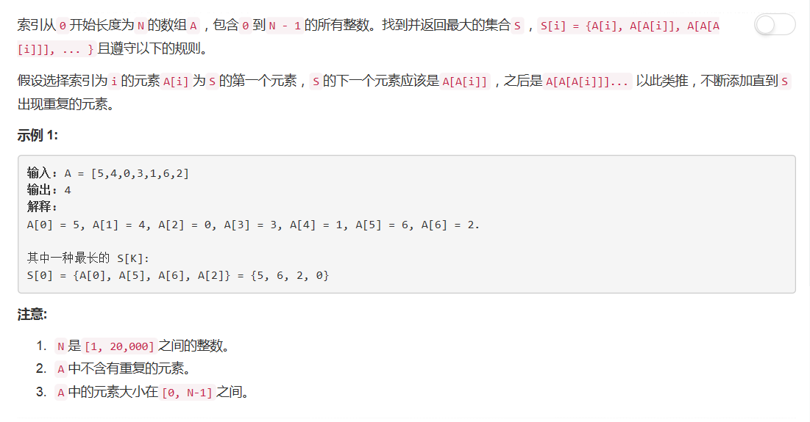

# 565 - 数组嵌套

## 题目描述


## first try
思路：  
就是按照规则一个个判断嘛，然后稀里糊涂写了以下代码：  
```python
class Solution(object):
    def arrayNesting(self, nums):
        """
        :type nums: List[int]
        :rtype: int
        """
        if not nums or len(nums) == 0:
        	return 0

        a = []
        total = 0
        n = 0
        maxSize = 0
        x = nums[0]
        while total < len(nums) and x not in a:
        	a.append(x)
        	x = nums[x]
        	n += 1
        return n
```

然后出错了，我当时想excuse me？这题不是就这么简单的吗？
噢！恍然大悟醍醐灌顶当头棒喝啊哈哈，我这个猪连题目都没搞清楚(´(00)\`)  
人家明明就是说找到符合规则的最大集合的size嘛，我刚刚的直线型思路只能直接求以第一个元素开始的符合规则的集合的size。

## second try
思路：  
1. 还是从第一个元素开始判断；
2. 每访问一个元素就将其标记为visited，因为同一个元素只能出现在一个circle里；
3. 如果这个circle断掉了，就从还没有访问的元素开始构造新的circle；
4. 每结束一个circle更新最大size。

```python
class Solution(object):
    def arrayNesting(self, nums):
        """
        :type nums: List[int]
        :rtype: int
        """
        a = []
        n = 0
        maxSize = 0
        for i in range(len(nums)):
        	while i not in a:
        		a.append(i)
        		i = nums[i]
        		n += 1
        	maxSize = max(maxSize, n)
        	n = 0
        return maxSize
```
嚯嚯嚯~~超时了/坚强的活下去_(°ω°｣∠)_

## third try
标记是否访问过要不要这么麻烦啊楼上的，用Boolean啊，不要每次都去数组里找啊佷耗时的人生苦短啊兄弟( ･´ω\`･ )

```python
class Solution(object):
    def arrayNesting(self, nums):
        """
        :type nums: List[int]
        :rtype: int
        """
        maxSize = 0		# 最大集合size
        n = 0			# 临时记录每个集合size
        visited = [False] * len(nums)
        for i in range(len(nums)):
        	while not visited[i]:
        		visited[i] = True
        		i = nums[i]
        		n += 1
        	maxSize = max(maxSize, n)
        	n = 0
        return maxSize
```