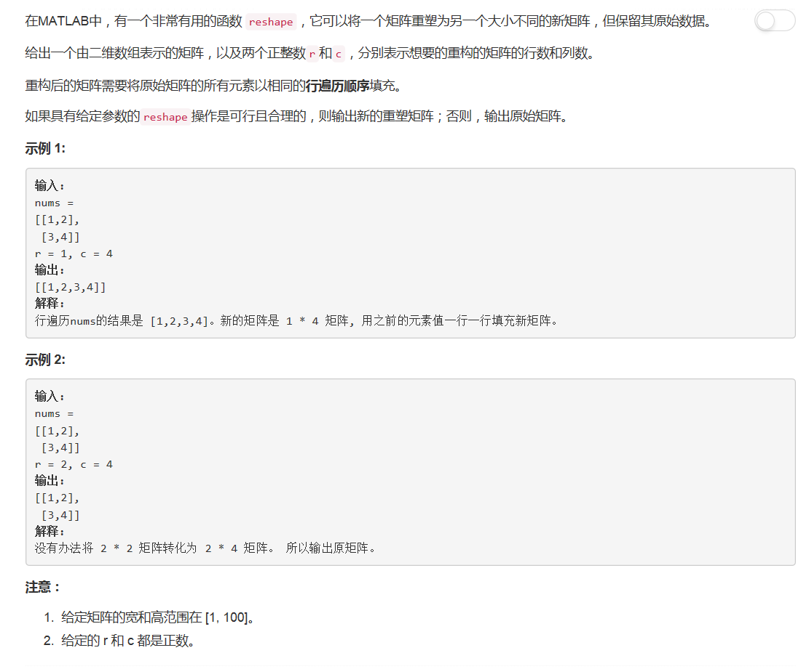

# 566 - 重塑矩阵

## 题目描述


## 题解一
思路：
1. 先判断参数是否合理，不合理就直接返回原矩阵；
2. 降维： 二维矩阵 -> 一维数组；
3. 将一维数组中的每c个元素构造成新的一行加入返回矩阵。

```python
class Solution(object):
    def matrixReshape(self, nums, r, c):
        """
        :type nums: List[List[int]]
        :type r: int
        :type c: int
        :rtype: List[List[int]]
        """
        # 判断特殊情况
        m = len(nums)
        n = len(nums[0])
        if not m or not n or m*n != r*c:
            return nums

        # 降维
        listNums = []
        [listNums.extend(item) for item in nums]

        # 构造新的矩阵
        ret = []
        for i in range(r):
            ret.append(listNums[i*c:(i+1)*c])
        return ret
```

**以下都是参考[Python Solutions](https://leetcode.com/problems/reshape-the-matrix/discuss/102500/Python-Solutions)**

## 题解二
>Numpy是Python的一个科学计算的库，提供了矩阵运算的功能，其一般与Scipy、matplotlib一起使用。其实，list已经提供了类似于矩阵的表示形式，不过numpy为我们提供了更多的函数。
>numpy.tolist(): 将数组或者矩阵转换成列表 

```python
import numpy as np

class Solution(object):
    def matrixReshape(self, nums, r, c):
        try:
            return np.reshape(nums, (r, c)).tolist()
        except:
            return nums
```

## 题解三
>1. sum(nums, []): 降维；
2. iter() 函数用来生成迭代器，返回迭代器对象；
3. zip() 函数用于将可迭代的对象作为参数，将对象中对应的元素打包成一个个元组，然后返回由这些元组组成的列表。如果各个迭代器的元素个数不一致，则返回列表长度与最短的对象相同，利用 * 号操作符，可以将元组解压为列表。
```python
class Solution(object):
    def matrixReshape(self, nums, r, c):
        flat = sum(nums, [])
        if len(flat) != r * c:
            return nums
        tuples = zip(*([iter(flat)] * c))
        return map(list, tuples)
```

## 题解四
>1. itertools模块包含创建有效迭代器的函数，可以用各种方式对数据进行循环操作，此模块中的所有函数返回的迭代器都可以与for循环语句以及其他包含迭代器（如生成器和生成器表达式）的函数联合使用。
2. chain(iter1, iter2, ..., iterN)：  
给出一组迭代器(iter1, iter2, ..., iterN)，此函数创建一个新迭代器来将所有的迭代器链接起来，返回的迭代器从iter1开始生成项，知道iter1被用完，然后从iter2生成项，这一过程会持续到iterN中所有的项都被用完。
3. islice(iterable, [start, ] stop [, step]):
创建一个迭代器，生成项的方式类似于切片返回值： iterable[start : stop : step]，将跳过前start个项，迭代在stop所指定的位置停止，step指定用于跳过项的步幅。与切片不同，负值不会用于任何start，stop和step，如果省略了start，迭代将从0开始，如果省略了step，步幅将采用1.

```python
import itertools
class Solution(object):
    def matrixReshape(self, nums, r, c):
        if r * c != len(nums) * len(nums[0]):
            return nums
        it = itertools.chain(*nums)
        return [list(itertools.islice(it, c)) for _ in range(r)]
```