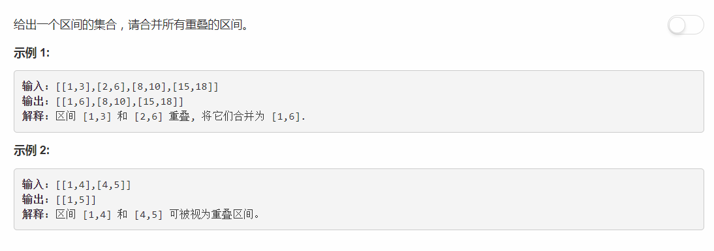

# 56 - 合并区间

## 题目描述


>关联题目： [57. 插入区间](https://github.com/Rosevil1874/LeetCode/tree/master/Python-Solution/57_Insert-Interval)


## 题解
思路：
1. 将intervals按区间的start升序排列；
2. 对interval中的每个区间，由于已经按start排序了，所以只需与前一个区间比较；
3. 若后一个区间的start小于等于前一个区间的end，说明两区间相交，合并时只需将end赋值为大的那一个即可。

```python
# Definition for an interval.
# class Interval(object):
#     def __init__(self, s=0, e=0):
#         self.start = s
#         self.end = e

class Solution(object):
    def merge(self, intervals):
        """
        :type intervals: List[Interval]
        :rtype: List[Interval]
        """
        res = []
        intervals.sort( key=lambda i: i.start)

        for i in intervals:
        	if res and i.start <= res[-1].end:
        		res[-1].end = max(res[-1].end, i.end)
        	else:
        		res.append(i)
        return res
```

## 不占用额外空间的方法
>即每次合并后删除原始区间

```python
# Definition for an interval.
# class Interval(object):
#     def __init__(self, s=0, e=0):
#         self.start = s
#         self.end = e

class Solution(object):
    def merge(self, intervals):
        """
        :type intervals: List[Interval]
        :rtype: List[Interval]
        """
        intervals.sort( key=lambda i: i.start)

        i = 0
        while i < (len(intervals) - 1):
        	j = i + 1
        	if intervals[j].start <= intervals[i].end:
        		intervals[i].end = max(intervals[i].end, intervals[j].end)
        		del intervals[j]
        	else:
        		i += 1

        return intervals
```

## debug
排序代码如下：  
`intervals.sort(lambda a, b: cmp(a.start, b.start))`  

出错：  
`TypeError: must use keyword argument for key function`

查看官方文档中关于sort函数的定义：
>sorted ( iterable [ , key ] [ , reverse ] ) ¶
Return a new sorted list from the items in iterable .Has two optional arguments which must be specified as keyword arguments.
key specifies a function of one argument that is used to extract a comparison key from each list element: key=str.lower . The default value is None .
reverse is a boolean value. If set to True , then the list elements are sorted as if each comparison were reversed.
To convert an old-style cmp function to a key function, see the CmpToKey recipe in the ASPN cookbook .

很明确的，上面出错的用法是Python2中所使用的，Python3中直接指定一个key作为比较基准。所以更改后代码如下：
`intervals.sort( key=lambda i: i.start)`