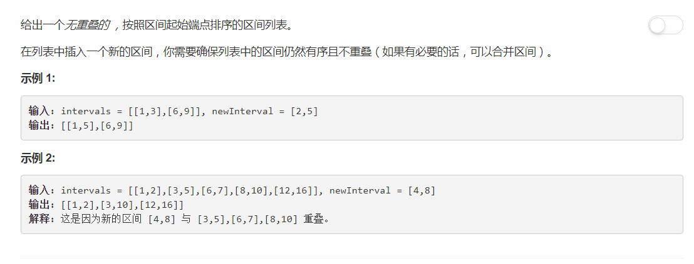

# 57 - 插入区间

## 题目描述


>关联题目： [56. 合并区间](https://github.com/Rosevil1874/LeetCode/tree/master/Python-Solution/56_Merge-Intervals)  
虽然直接把新区间加入数组然后复用merge interval的算法非常方便，但是我们也不能这么懒啊是吧。

## 题解一
>思路：
1. 从前往后遍历每个区间：
    1. 如果新区间的末尾小于当前区间的开头，则跳出循环；
    2. 如果新区间的开头大于当前区间的末尾，不作处理；
    3. 如果新区间和当前区间有重叠，合并到新区间；
2. 如果有区间重叠，删除数组中所有与新区间重叠的区间；
3. 将新区间插入对应位置。

```python
# Definition for an interval.
# class Interval(object):
#     def __init__(self, s=0, e=0):
#         self.start = s
#         self.end = e

class Solution(object):
    def insert(self, intervals, newInterval):
        """
        :type intervals: List[Interval]
        :type newInterval: Interval
        :rtype: List[Interval]
        """
        n = len(intervals)
        overlap = 0         # 重叠区间数
        i = 0
        while i < n:
            # 1. 如果新区间的末尾小于当前区间的开头，则跳出循环
            if newInterval.end < intervals[i].start:
                break
            # 2. 如果新区间的开头大于当前区间的末尾，不作处理
            elif newInterval.start > intervals[i].end:
                pass
            # 3. 如果新区间和当前区间有重叠，合并区间
            else:
                newInterval.start = min(intervals[i].start, newInterval.start)
                newInterval.end = max(intervals[i].end, newInterval.end)
                overlap += 1
            i += 1

        # 如果有区间重叠，删除数组中所有与新区间重叠的区间
        if overlap > 0:
            intervals = intervals[:i-overlap] + intervals[i:]
        intervals.insert( i - overlap, newInterval)
        return intervals
```

## 题解二
>cr: [[Leetcode][python]Insert Interval](https://blog.csdn.net/qqxx6661/article/details/78210191)  
感觉这位兄台的思路好厉害啊，佩服佩服(｡◕ˇ∀ˇ◕)

思路：
1. 根据新区间端点将区间数组划分为左右两部分，左边是严格小于新区间的，右边是严格大于新区间的；
2. 若这两部分的和与原区间列表长度小，则说明中间部分有重叠区间，需要合并；
3. 将 **左边数组 + 中间合并后的区间 + 右边数组** 组合返回

```python
# Definition for an interval.
# class Interval(object):
#     def __init__(self, s=0, e=0):
#         self.start = s
#         self.end = e

class Solution(object):
    def insert(self, intervals, newInterval):
        """
        :type intervals: List[Interval]
        :type newInterval: Interval
        :rtype: List[Interval]
        """
        start, end = newInterval.start, newInterval.end
        left = list( filter(lambda x: x.end < start, intervals) )
        right = list( filter(lambda x: x.start > end, intervals) )
        if len(left) + len(right) != len(intervals):
            start = min(start, intervals[len(left)].start)
            end = max(end, intervals[-len(right)-1].end)
        return left + [Interval(start, end)] + right
```
