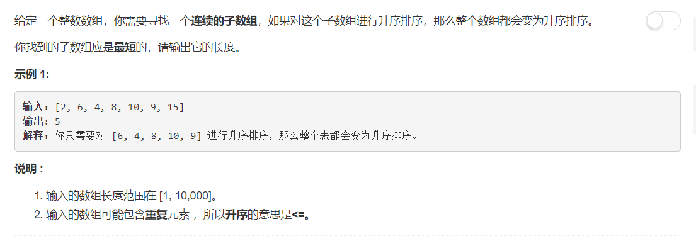
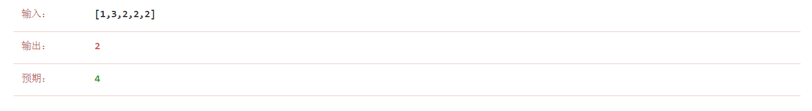

# 581 - 最短无序连续子数组

## 题目描述


### 双指针
两边指针向中间靠拢，一旦发现乱序就停止移动，两指针中间部分即为需要排序的部分。 **wrong**
```python
class Solution:
    def findUnsortedSubarray(self, nums: List[int]) -> int:
        n = len(nums)
        left, right = 0, n - 1
        while left < right and nums[left] <= nums[left + 1]:
            left += 1
        while left < right and nums[right] >= nums[right - 1]:
            right -= 1
        return 0 if left >= right else right - left + 1
```
然而。。。当最右边为乱序且有相同数字时，这些相同数字会依据升序的判定条件被视为有序，导致结果比预期小。



### 解法二
compton_scatter同学的解法[Java O(n) Time O(1) Space](https://leetcode.com/problems/shortest-unsorted-continuous-subarray/discuss/103057/Java-O(n)-Time-O(1)-Space)： 
>I use the variables beg and end to keep track of minimum subarray A[beg...end] which must be sorted for the entire array A to be sorted. If end < beg < 0 at the end of the for loop, then the array is already fully sorted.

其实思路是大同小异的，只是针对上面出现的错误情况改变了比较方法，不是和相邻元素比较而是和有序子序列中的最值比较，解决了以上问题，✌。  
把beg改成start吧，怪怪的。。。

```python
class Solution:
    def findUnsortedSubarray(self, nums: List[int]) -> int:
        n = len(nums)
        start, end = -1, -2
        left_max, right_min = nums[0], nums[n - 1]
        
        for i in range(1, n):
            left_max = max(left_max, nums[i])
            right_min = min(right_min, nums[n - 1 - i])
            if nums[i] < left_max:
                end = i
            if nums[n - 1 - i] > right_min:
                start = n - 1 - i
        return end - start + 1
```