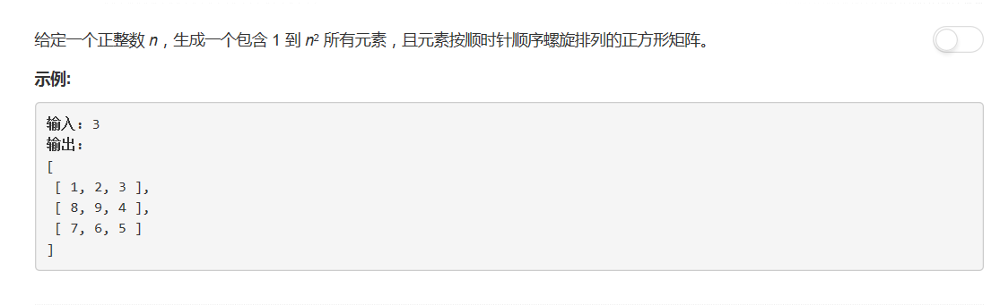

# 59 - 螺旋矩阵 II

## 题目描述


## 解法一
>类似第54题（螺旋矩阵）

思路：
1. 以n为矩阵行列数，分别找到行列起止点rowBegin, rowEnd, colBegin, colEnd；
2. 按螺旋形遍历所有元素为0的矩阵，每遍历一个位置为其赋值（从1开始依次递增）；
3. 向右遍历后rowBegin++，向下遍历后colEnd--，向左遍历后rowEnd--，向上遍历后colBegin++；
4. 直到行、列的起止点相遇；
5. 注意向左和向上遍历时需要检查此元素是否已经遍历过。

```python
class Solution(object):
    def generateMatrix(self, n):
        """
        :type n: int
        :rtype: List[List[int]]
        """
        if n == 0:
            return []

        res = [ [0] * n for i in range(n) ]
        num = 1
        rowBegin = colBegin = 0
        rowEnd = colEnd = n - 1
        
        while rowBegin <= rowEnd and colBegin <= colEnd:
            # 向右
            for j in range(colBegin, colEnd + 1):
                res[rowBegin][j] = num
                num += 1
            rowBegin += 1

            # 向下
            for i in range(rowBegin, rowEnd + 1):
                res[i][colEnd] = num
                num += 1
            colEnd -= 1

            # 向左
            j = colEnd
            while j >= colBegin and rowBegin <= rowEnd:
                res[rowEnd][j] = num
                num += 1
                j -= 1
            rowEnd -= 1

            # 向上
            i = rowEnd
            while i >= rowBegin and colBegin <= colEnd:
                res[i][colBegin] = num
                num += 1
                i -= 1
            colBegin += 1
            
        return res
```

## 注意
>二维矩阵的初始化方法

由于我需要初始化一个全为0的二维矩阵，这里我使用了这样的方法：
`[ [0] * n ] * n`

但改变其中一个一维数组后的结果却是这样：
`[[1, 2, 3], [1, 2, 3], [1, 2, 3]]`

即每次都是二维矩阵里面的n个一维数组同时在变，原因在于这种方式是先初始化了一个全为0的一维数组，然后复制这个数组为n份装进二维矩阵中，此时矩阵中的n个一维数组实际上是同一个。

使用另一种方法：
`res = [ [0] * n for i in range(n) ]`

现在得到了预期的效果：
`[[1, 2, 3], [8, 9, 4], [7, 6, 5]]`

与第一种方法的不同在于，这次是初始化了n个不同的全为0的一维数组，所以每次改变的都是不同的数组中的元素。