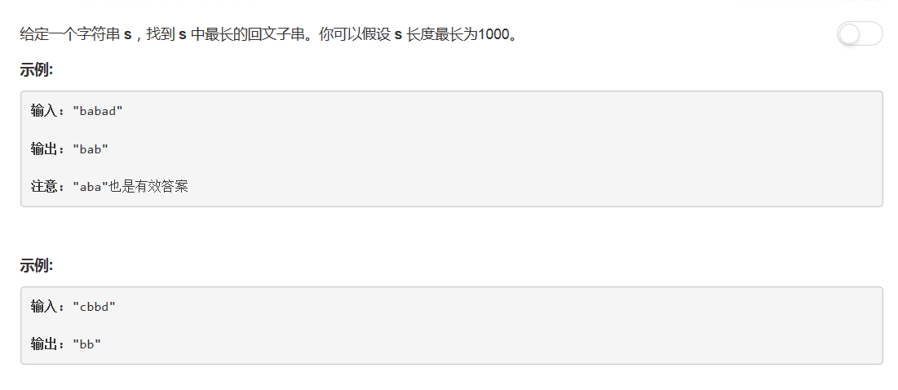

# 5 - 最长回文子串

## 题目描述


<!-- more -->

## 一、中心扩展法
思路：
1. 分别以每个元素为中心，找出偶数长度的最长回文子串和奇数长度的最长回文子串
2. 取奇偶中最长的一个
3. 取所有元素为中心的最长的一个
```python
class Solution:
    def longestPalindrome(self, s):
        """
        :type s: str
        :rtype: str
        """
        l = len(s)
        if l <= 1:
            return s

        start = 0
        max_len = 0
        max_s = ''
        for i in range(1, l):
            low = i - 1
            high = i
            while low>=0 and high<l and s[low]==s[high]:
                low -= 1
                high += 1
            if high-low+1 > max_len:
                max_len = high-low+1
                max_s = s[low+1 : high]

            low = i - 1
            high = i + 1
            while low>=0 and high<l and s[low]==s[high]:
                low -= 1
                high += 1
            if high-low+1 > max_len:
                max_len = high-low+1
                max_s = s[low+1 : high]
        return max_s
```

## 二、动态规划
>时间复杂度：O(n^2)
思路：
1. dp[i][j]表示字符串s[i...j]是否回文；
2. 初始化：dp[i][i] = True(0 <= i <= n-1)；dp[i][i-1] = True(1 <= i <= n - 1)；其余的初始化为false；
3. dp[i][i] = ( s[i] == s[j] && dp[i+1][j-1] == True)；
4. 动态规划过程中保存回文长度和起止点。

```python
class Solution:
    def longestPalindrome(self, s):
        """
        :type s: str
        :rtype: str
        """
        l = len(s)
        if l <= 1:
            return s

        # dp[i][j]表示s[i..j]是回文串
        dp = [ [False] * l ] * l
        resLeft = resRight = 0
        dp[0][0] = True
        for i in range(1, l):
            dp[i][i] = True
            dp[i][i-1] = True

        for i in range(2, l + 1):       # 枚举子串长度，从2开始
            for j in range(0, l - i):   # 枚举子串起始位置
                if s[j] == s[j + i - 1] and dp[j + 1][j + i - 2]:
                    dp[j][j + i - 1] = True
                    if resRight - resLeft < i:
                        resLeft = j
                        resRight = j + i - 1
        return s[resLeft : resRight + 1 ]
```

## 三、Manacher算法
>cr:[最长回文子串——Manacher 算法](https://segmentfault.com/a/1190000003914228)
时间复杂度：O(n)

思路：
1. 预处理：在字符串所有空隙中加入同一个特殊符号，使偶数和奇数长度的字符串都变成奇数长度，且不影响回文判断；
2. 用RL[i]表示以第i个字符为对称轴的回文串的回文半径；
3. pos为当前最长回文串的对称轴位置，maxLen为当前所有回文串中能到达的最右一个字符的位置；
4. 依次求每个字符的回文半径，求到当前最长回文半径的同时更新pos和maxLen.

求RL[i]的方法参考：[最长回文子串——Manacher 算法](https://segmentfault.com/a/1190000003914228)

```python
class Solution:
    def longestPalindrome(self, s):
        """
        :type s: str
        :rtype: str
        """
        # 字符串预处理
        s = '#' + '#'.join(s) + '#'

        RL = [0] * len(s)
        maxRight = 0
        maxLen = 0
        pos = 0
        resLeft = 0
        resRight = 0

        for i in range(len(s)):
            if i < maxRight:
                RL[i] = min(RL[2 * pos - i], maxRight - i)
            else:
                RL[i] = 1

            # 扩展
            while i - RL[i] >= 0 and i + RL[i] < len(s) and s[i - RL[i]] == s[i + RL[i]] :
                RL[i] += 1

            # 更新maxRight和pos
            if i + RL[i] - 1 > maxRight:
                maxRight = i + RL[i] - 1
                pos = i


            if RL[i] >= maxLen:
                resLeft = i - RL[i] + 1
                resRight = i + RL[i]
                maxLen = RL[i]
        res = s[resLeft : resRight]
        return res.replace('#', '')
```