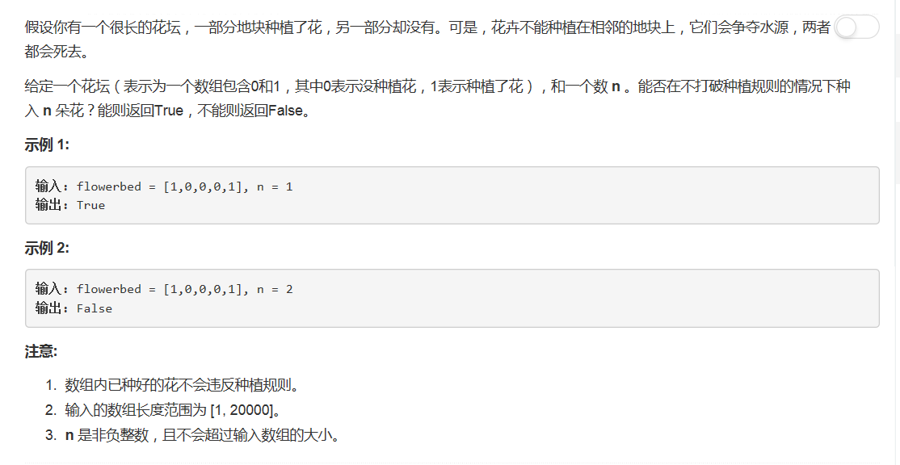

# 605 - 种花问题

## 题目描述


## 题解
思路：
1. 维护一个变量cnt，表示能种进去多少朵花；
2. 遍历数组，若某元素为0，且前后均为0，代表可以在此处种一朵花，那么就在这种上一朵（flowerbed[i] = 1），且cnt+1；
3. 当cnt=n或遍历完数组时退出循环；
4. 退出循环后若cnt == n，代表可以种n朵花，返回true，否则返回false。

```python
class Solution(object):
    def canPlaceFlowers(self, flowerbed, n):
        """
        :type flowerbed: List[int]
        :type n: int
        :rtype: bool
        """
        cnt = i = 0
        while i < len(flowerbed) and cnt < n:
            if flowerbed[i] == 0:
                prev = 0 if (i == 0) else flowerbed[i - 1]
                next = 0 if (i == len(flowerbed) - 1) else flowerbed[i + 1]
                if prev == 0 and next == 0:
                    flowerbed[i] = 1
                    cnt += 1
            i += 1
        return cnt == n
```
