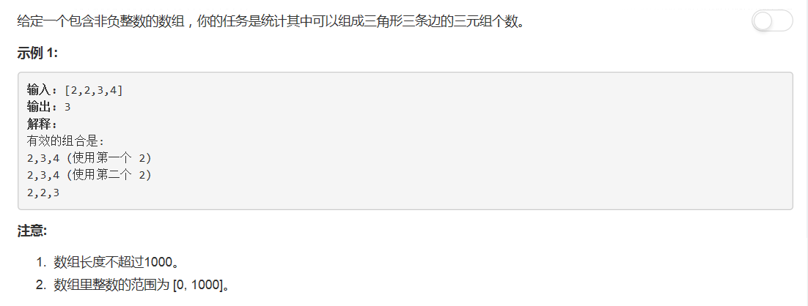

# 611 - 有效三角形的个数

## 题目描述


>相似题目[15.三数之和](https://github.com/Rosevil1874/LeetCode/tree/master/Python-Solution/15_3Sum)


>审题：  
1. 能组成三角形三条边的条件是什么：两边之和大于第三边，两边之差小于第三边；
2. 三重循环？绝对超时，那就三个指针吧(｡◕ˇ∀ˇ◕)

## 三指针
思路：  
1. 数组升序排序；
2. 指针i指向最长边，从第三个位置开始遍历数组；
3. 指针left和right分别指向指针i之前的最左和最右元素，代表两条较短边，此时：
	- nums[right] - nums[left] < nums[i]必然满足；
	- 判断nums[left] + nums[right] > nums[i]：
		- 若满足，此时left到right中间的元素之和均满足大于最长边，所以结果加上（right-left），同时right左移
		- 否则left右移

```python
class Solution(object):
    def triangleNumber(self, nums):
        """
        :type nums: List[int]
        :rtype: int
        """
        cnt = 0
        nums.sort()
        for i in range(2, len(nums)):
        	left, right = 0, i - 1
        	while left < right:
        		if nums[left] + nums[right] > nums[i]:
        			cnt += (right - left)
        			right -=1
        		else:
        			left += 1
        return cnt
```