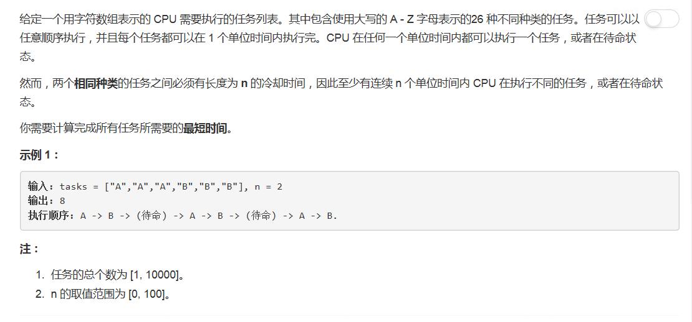

# 621 -  任务调度器

## 题目描述


## 题解
参考sha256pki在discuss一个回答下的评论。

### collections模块：   
collections模块自Python 2.4版本开始被引入，包含了dict、set、list、tuple以外的一些特殊的容器类型，分别是：
- OrderedDict类：排序字典，是字典的子类。
- namedtuple()函数：命名元组，是一个工厂函数。
- Counter类：为hashable对象计数，是字典的子类。
- deque：双向队列。
- defaultdict：使用工厂函数创建字典，使不用考虑缺失的字典键。

### counter类：  
Counter类的目的是用来跟踪值出现的次数。它是一个无序的容器类型，以字典的键值对形式存储，其中元素作为key，其计数作为value。计数值可以是任意的Interger（包括0和负数）。
>常用操作：  
- c.elements()  返回一个迭代器
- c.items()  # 转为(elem, cnt)格式的列表
- c.clear()  # 重置Counter对象，注意不是删除
- list(c)  # 将c中的键转为列表
- set(c)  # 将c中的键转为set
- dict(c)  # 将c中的键值对转为字典
- sum(c.values())  # 所有计数的总数

### 思路：  
1. 计算出现次数最多的任务（假设为"A"）所需的最大CPU：max_cpu；
2. 将第一个A放在第一个位置之后还有("max_cpu - 1)个A，它们每两个之间需要隔开为（n + 1)个位置，总共`(max_cpu - 1)*(n + 1)`个位置；
3. 把最重要的任务放在第一位，对于每一个最频繁的任务，再增加一个空间（最后）；
4. 如果任务数组中的空间数量已经足够大以适应这种安排，就直接返回任务数组，否则返回计算值。

```python
class Solution(object):
    def triangleNumber(self, nums):
        """
        :type nums: List[int]
        :rtype: int
        """
        cnt = 0
        nums.sort()
        for i in range(2, len(nums)):
        	left, right = 0, i - 1
        	while left < right:
        		if nums[left] + nums[right] > nums[i]:
        			cnt += (right - left)
        			right -=1
        		else:
        			left += 1
        return cnt
```