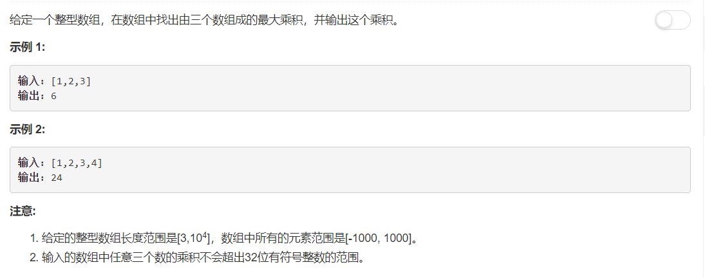

# 628 - 三个数的最大乘积

## 题目描述



### 题解：
**思路**    
由于是三个数的乘积，考虑到负数，一共有两种情况：
1. 三个正数中的最大数的乘积；
2. 正数最大数和负数两个绝对值最大数(最小数)的乘积。

```python
class Solution:
    def maximumProduct(self, nums):
        """
        :type nums: List[int]
        :rtype: int
        """
        max1, max2, max3 = float('-inf'), float('-inf'), float('-inf')
        min1, min2 = float('inf'), float('inf')

        for x in nums:
            if x > max1:
                max3, max2, max1 = max2, max1, x
            elif x > max2:
                max3, max2 = max2, x
            elif x > max3:
                max3 = x

            if x < min1:
                min2, min1 = min1, x
            elif x < min2:
                min2 = x
                
        return max(max1 * max2 * max3, max1 * min1 * min2)
```

### 简化代码：
先排序不久很容易知道最值了吗哈哈哈
```python
class Solution:
    def maximumProduct(self, nums):
        nums.sort()
        return max(nums[-1] * nums[-2] * nums[-3], nums[-1] * nums[0] * nums[1])
```