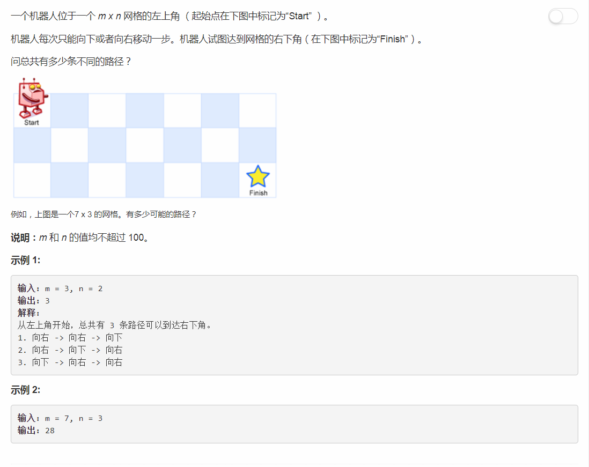

# 62 - 不同路径

## 题目描述


>关联题目： [63. 不同路径II](https://github.com/Rosevil1874/LeetCode/tree/master/Python-Solution/63_Unique-Paths-II)  
>关联题目： [64. 最小路径和](https://github.com/Rosevil1874/LeetCode/tree/master/Python-Solution/64_UMinimum-Path-Sum)  

>cr: [0ms, 5-lines DP Solution in C++ with Explanations](https://leetcode.com/problems/unique-paths/discuss/22954/0ms-5-lines-DP-Solution-in-C++-with-Explanations)  
我要什么时候才能看到题目就像大神一样说出一句：“emmm，这是基本的DP问题”呢(T ^ T) 

## 题解一
**时间复杂度：O(n^2)  
空间复杂度：O(m\*n)**

**思路**
1. 机器人每次只能向下或者向右移动一步，则当机器人到达某一点时有以下两种情况：
	1. 从上面的格子下来p[i - 1][j]；
	2. 从左边的格子过来p[i][j - 1]；
2. 由第一条得出状态方程：  
	1. p[i][j]: 机器人走到(i, j)处的路径条数；
	2. p[i][j] = p[i - 1][j] + p[i][j - 1]；
3. 边界条件为最左列和最上行不存在的情况，可以通过初始化p[0][j] = 1，p[i][0] = 1来处理，**注意是1不是0**。

```python
class Solution(object):
    def uniquePaths(self, m, n):
        """
        :type m: int
        :type n: int
        :rtype: int
        """
        p = [ [1] * m for i in range(n) ]
        for i in range(1, n):
        	for j in range(1, m):
        		p[i][j] = p[i - 1][j] + p[i][j - 1]
        return p[n - 1][m - 1]
```

## 题解二
**时间复杂度：O(n^2)  
空间复杂度：O(m)**

**思路**
更新p[i][j]时只需要用到 p[i - 1][j] 和 p[i][j - 1]，所以只需要保存当前行和上一行的状态，而不是整个矩阵的状态。

```python
class Solution(object):
    def uniquePaths(self, m, n):
        """
        :type m: int
        :type n: int
        :rtype: int
        """
        prev = [1] * m
        curr = [1] * m
        for i in range(1, n):
        	for j in range(1, m):
        		curr[j] = prev[j] + curr[j - 1]
        	prev, curr = curr, prev
        return prev[m - 1]
```

## 题解三

**思路：**  
可以看出题解二中的prev只是更新为了curr，所以连两个数组都用不上，用一个累加就行。

```python
class Solution(object):
    def uniquePaths(self, m, n):
        """
        :type m: int
        :type n: int
        :rtype: int
        """
        curr = [1] * m
        for i in range(1, n):
        	for j in range(1, m):
        		curr[j] += curr[j - 1]
        return curr[m - 1]
```