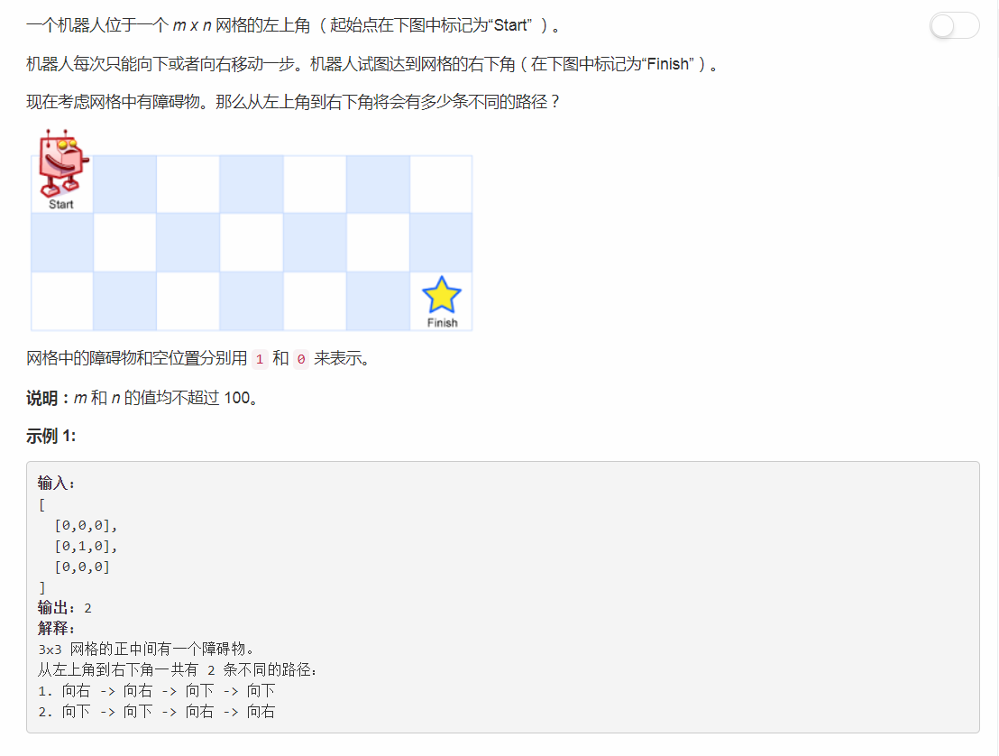

# 63 - 不同路径II

## 题目描述


>关联题目： [62. 不同路径](https://github.com/Rosevil1874/LeetCode/tree/master/Python-Solution/62_Unique-Paths)  
>关联题目： [64. 最小路径和](https://github.com/Rosevil1874/LeetCode/tree/master/Python-Solution/64_UMinimum-Path-Sum)  

>**和62题的不同之处**  
网格中是有障碍物的，障碍物是不能到达的点，所以状态方程中需要加一条：若当前格子中为1，那么p[i][j] = 0，即到这个格子的路径为0条；


## 题解一
**时间复杂度：O(n^2)  
空间复杂度：O(m\*n)**

**思路**
1. 假设下标从1开始；
2. 机器人每次只能向下或者向右移动一步，则当机器人到达某一点时有以下两种情况：
	1. 从上面的格子下来p[i - 1][j]；
	2. 从左边的格子过来p[i][j - 1]；
3. 由第一条得出状态方程：  
	1. p[i][j]: 机器人走到(i, j)处的路径条数；
	2. p[i][j] = p[i - 1][j] + p[i][j - 1] if obstacleGrid[i][j] == 0；
    3. p[i][j] = 0 if obstacleGrid[i][j] == 1；
4. 由于下标从一开始，为了统一边界，可以通过初始化p[0][1] = 1，这样我们就没有初始化到任何一个格子的路径为1，同时又能不影响DP方程。

```python
class Solution(object):
    def uniquePathsWithObstacles(self, obstacleGrid):
        """
        :type obstacleGrid: List[List[int]]
        :rtype: int
        """
        n = len(obstacleGrid)       # 行数
        if n == 0:
            return 0

        m = len(obstacleGrid[0])    # 列数
        p = [ [0] * (m + 1) for i in range(n + 1) ]
        p[0][1] = 1
        for i in range(1, n + 1):
            for j in range(1, m + 1):
                if obstacleGrid[i - 1][j - 1] == 0:
                    p[i][j] = p[i - 1][j] + p[i][j - 1]
        return p[n][m]
```

## 题解二
**时间复杂度：O(n^2)  
空间复杂度：O(m)**

**思路**
更新p[i][j]时只需要用到 p[i - 1][j] 和 p[i][j - 1]，所以只需要保存当前行和上一行的状态，而不是整个矩阵的状态。

```python
class Solution(object):
    def uniquePathsWithObstacles(self, obstacleGrid):
        """
        :type obstacleGrid: List[List[int]]
        :rtype: int
        """
        n = len(obstacleGrid)       # 行数
        if n == 0:
            return 0

        m = len(obstacleGrid[0])    # 列数
        prev = curr = [1] + [0] * (m - 1)
        for i in range(n):
            for j in range(m):
                if obstacleGrid[i][j] == 1:
                    curr[j] = 0
                elif j > 0:
                    curr[j] = prev[j] + curr[j - 1]
            prev, curr = curr, prev
        return prev[m - 1]
```

## 题解三

**思路：**  
可以看出题解二中的prev只是更新为了curr，所以连两个数组都用不上，用一个累加就行。

```python
class Solution(object):
    def uniquePathsWithObstacles(self, obstacleGrid):
        """
        :type obstacleGrid: List[List[int]]
        :rtype: int
        """
        n = len(obstacleGrid)       # 行数
        if n == 0:
            return 0

        m = len(obstacleGrid[0])    # 列数
        curr = [1] + [0] * (m - 1)
        for i in range(n):
            for j in range(m):
                if obstacleGrid[i][j] == 1:
                    curr[j] = 0
                elif j > 0:
                    curr[j] += curr[j - 1]
        return curr[m - 1]
```