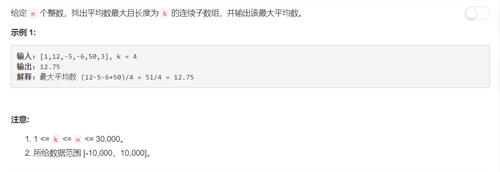

# 643 - 子数组最大平均数 I

## 题目描述



### 题解：
**思路**    
将求最大平均数问题转化为求最大和问题，解决过程类似计算机网络中的滑窗协议，维护一个大小为k的窗口，依次向后滑动一个元素，求其和。找出和最大的窗口，其平均值自然也就最大，然而超时了。

```python
class Solution:
    def findMaxAverage(self, nums, k):
        """
        :type nums: List[int]
        :type k: int
        :rtype: float
        """
        maxinum = float('-inf')
        for i in range(len(nums) - k + 1):
            theSum = sum(nums[i : i + k])
            maxinum = max(theSum, maxinum)
        return maxinum / k
```

### 拯救TLE：
明明只有一个循环，为什么会超时呢。。。还不是因为你用了太多函数啦，把sum()函数的使用替换掉，就老老实实减掉第一个元素再加上后一个元素进行窗口的滑动，这样就完美解决了哈哈哈<(￣︶￣)>
```python
class Solution:
    def findMaxAverage(self, nums, k):
        """
        :type nums: List[int]
        :type k: int
        :rtype: float
        """
        theSum = sum(nums[0 : k])
        maxinum = theSum

        for i in range(k, len(nums)):
            theSum += nums[i] - nums[i - k]
            maxinum = max(theSum, maxinum)
        return maxinum / k
```