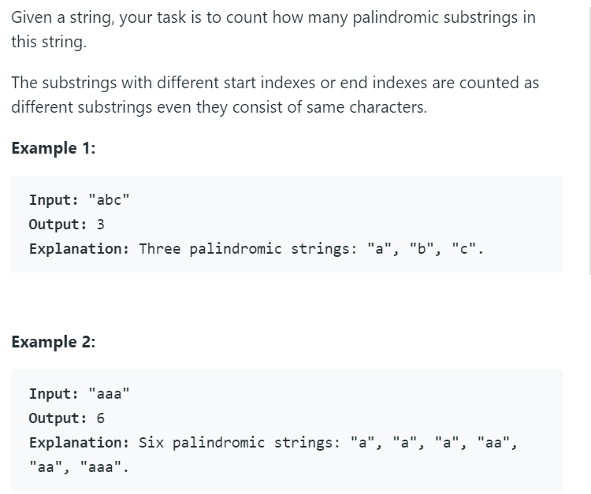

# 647 - 回文子序列

## 题目描述



### 题解：
**思路** ： 中心扩张法，一个长度为N的字符串可能的回文中心共(2N-1)个，包括奇数和偶数的回文。对每一个可能的回文中心依次向两边扩张并判断是否为回文，将回文串加入结果序列中。  

```python
class Solution:
    def countSubstrings(self, s: str) -> int:
        n = len(s)
        cnt = 0
        
        for center in range(2*n - 1):
            left = center // 2
            right = center // 2 + center % 2
            while left >= 0 and right < n and s[left] == s[right]:
                cnt += 1
                left -= 1
                right += 1
        return cnt
```
