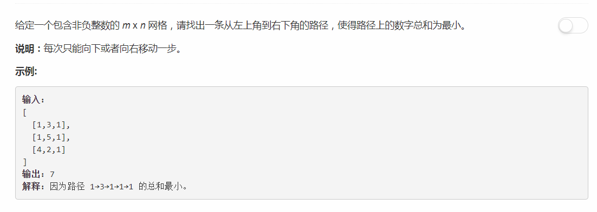

# 64 - 最小路径和

## 题目描述


>关联题目： [62. 不同路径](https://github.com/Rosevil1874/LeetCode/tree/master/Python-Solution/62_Unique-Paths)  
>关联题目： [63. 不同路径II](https://github.com/Rosevil1874/LeetCode/tree/master/Python-Solution/63_Unique-Paths-II)  


## 题解一
**时间复杂度：O(n^2)  
空间复杂度：O(m\*n)**

**思路**
1. 每次只能向下或者向右移动一步，则当机器人到达某一点时有以下两种情况,要得到最短路径，就从这两种情况中选择一个路径最短的：
	1. 从上面的格子下来p[i - 1][j]；
	2. 从左边的格子过来p[i][j - 1]；
2. 由第一条得出状态方程：  
	1. p[i][j]: 机器人走到(i, j)处的路径长度；
    2. p[0][j] = sum(p[0][0]...p[0][j])
    3. p[i][0] = sum(p[0][0]...p[i][0])
	4. p[i][j] = min(p[i - 1][j] + p[i][j - 1]) + p[i][j] if (i > 0 and j > 0)


```python

class Solution(object):
    def minPathSum(self, grid):
        """
        :type grid: List[List[int]]
        :rtype: int
        """
    
        n = len(grid)       # 行数
        if n == 0:
            return 0

        m = len(grid[0])    # 列数
        for i in range( n ):
            for j in range( m ):
                if i == 0 and j == 0:
                	pass
                elif i == 0:
                	grid[0][j] = grid[0][j-1] + grid[0][j]
                elif j == 0:
                	grid[i][0] = grid[i-1][0] + grid[i][0]
                else:
                	grid[i][j] = min(grid[i-1][j], grid[i][j-1]) + grid[i][j]
        return grid[n-1][m-1]
```


## 题解二
**时间复杂度：O(n^2)  
空间复杂度：O(m)**

**思路**
更新p[i][j]时只需要用到 p[i - 1][j] 和 p[i][j - 1]，所以只需要保存当前行和上一行的状态，而不是整个矩阵的状态。

```python
class Solution:
    def minPathSum(self, grid: List[List[int]]) -> int:
        n = len(grid)
        if n == 0:
            return 0
        
        m = len(grid[0])
        prev = [grid[0][0]] * m
        # 计算到第一行每个格子的路径长度
        for j in range(1, m):
            prev[j] = prev[j - 1] + grid[0][j]
         
        # 从上到下，从左到右计算到每个格子的最短路径
        curr = [0] * m
        for i in range(1, n):
            curr[0] = prev[0] + grid[i][0]
            for j in range(1, m):
                curr[j] = min(curr[j - 1], prev[j]) + grid[i][j]
            prev = curr     # 当前行是下一行的prev
        
        return prev[m - 1]
    
```


## 题解三

**思路：**  
可以看出题解二中的prev只是更新为了curr，所以连两个数组都用不上，用一个累加就行。缺点是代码可读性会差一点，分不清上一行和当前行。

```python

class Solution:
    def minPathSum(self, grid: List[List[int]]) -> int:
        n = len(grid)       # 行数
        if n == 0:
            return 0

        m = len(grid[0])    # 列数
        curr = [ grid[0][0] ] * m

        # 计算到第一行每个格子的路径长度
        for j in range(1, m):
            curr[j] = curr[j-1] + grid[0][j]
            
        for i in range( 1, n ):
            curr[0] += grid[i][0]
            for j in range( 1, m ):
                curr[j] = min(curr[j-1], curr[j]) + grid[i][j]
        return curr[m-1]
```