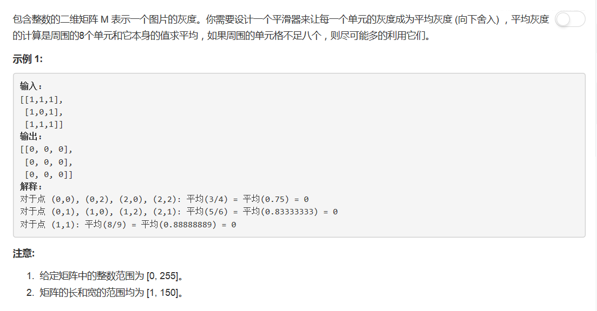

# 661 - 图片平滑器

## 题目描述


## 题解
>由于菜鸟本鸟没看懂题目说的啥，所以直接看人家的题解了。  
cr: [Straightforward python solution](https://leetcode.com/problems/image-smoother/discuss/106598/Straightforward-python-solution)  
事实证明，题意就是每九宫格算一次平均数，所以题目的对于例子的解释是个什么鬼。。。

思路：  
1. 复制原矩阵；
2. 对于每个元素，将直接与其相邻的元素

```python
from copy import deepcopy

class Solution(object):
    def imageSmoother(self, M):
        """
        :type M: List[List[int]]
        :rtype: List[List[int]]
        """
        row = len(M)
        col = len(M[0]) if row else 0
        res = deepcopy(M)
        for x in range(row):
            for y in range(col):
                neighbors = [
                    M[_x][_y]
                    for _x in (x-1, x, x+1)
                    for _y in (y-1, y, y+1)
                    if 0 <= _x < row and 0 <= _y < col
                ]
                res[x][y] = sum(neighbors) // len(neighbors)
        return res
```

## 题解二
**时间复杂度O(N), 空间复杂度O(1)**
>cr: [Short Python O(n) time O(1) space with Explanation](https://leetcode.com/problems/find-pivot-index/discuss/109255/Short-Python-O(n)-time-O(1)-space-with-Explanation)  

思路：  
其实思路和我上面还是一样的，只不过不用每次重新算sum，每向后遍历一个数就left+val同时right-val。唉其实读他的思路的第一句我就豁然开朗了，自己还是个菜鸡，这么简单的方法都没想到。。。
```python
class Solution(object):
    def pivotIndex(self, nums):
        """
        :type nums: List[int]
        :rtype: int
        """
        left, right = 0, sum(nums)
        for i, v in enumerate(nums):
            right -= v
            if left == right:
                return i
            left += v
        return -1
```