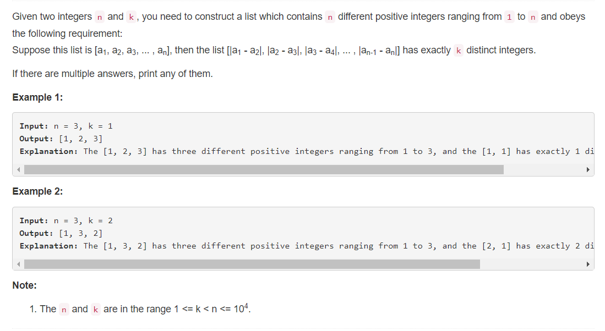

# 667 - Beautiful Arrangement II 【优美的排列】

## 题目描述


### 题意：
给定两个数字n，k，构造出所有满足以下条件的含有n个不同正整数[1, n]的序列：  
序列[a1, a2, a3, ... , an]中的元素满足[|a1 - a2|, |a2 - a3|, |a3 - a4|, ... , |an-1 - an|]中含有刚好k个不同整数。

### 题解：  
>参考博客Grandyang中的文章[[LeetCode] Beautiful Arrangement II 优美排列之二](http://www.cnblogs.com/grandyang/p/7577878.html)  

**思路**
假设n=5，以[1, 2, 3, 4, 5]为基础构造：  
1. 当k==1时，序列为[1, 2, 3, 4, 5]，差的绝对值序列为[1];
2. 当k==2时，序列为[5, 1, 2, 3, 4]，差的绝对值序列为[1, 4];
3. 当k==3时，序列为[1, 5, 2, 3, 4]，差的绝对值序列为[1, 3, 4];
4. 当k==4时，序列为[5, 1, 4, 2, 3]，差的绝对值序列为[1, 2, 3, 4];  

k至多为n-1，根据以上规律，使用双指针从两头向中间遍历数字加入结果序列。
1. 根据k的奇偶情况决定从头部还是尾部取数字；
2. 每取出一个数字将k自减1，k==1时按顺序从前往后取(差的绝对值值均为1).

```python
class Solution:
    def constructArray(self, n, k):
        """
        :type n: int
        :type k: int
        :rtype: List[int]
        """
        l, r = 1, n
        res = []
        while l <= r:
            if k > 1:
                if k % 2 == 1:
                    res.append(l)
                    l += 1
                else:
                    res.append(r)
                    r -= 1
            else:
                res.append(l)
                l += 1
            k -= 1
        return res
```
