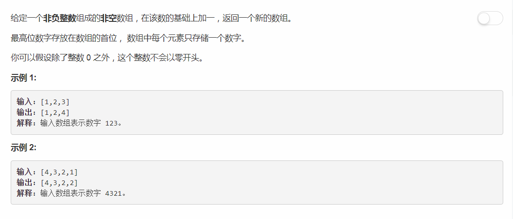

# 66 - 加一

## 题目描述


## 题解

**思路**
1. 若为空数组，返回0，额这个是我自行判断的，题目没有提到，可能测试用例中也没有这种情况吧；
2. 若个位数不为9，那么不存在进位，个位数加一返回即可；
3. 若个位数为9，那么加一之后各位为0，向前进一位。进位后依次判断前面的数值是否为9，是9就继续进位。进位结束后有两种情况：
    1. 进位在中间某一位结束，没有抵达最高位，那么就在结束进位的那一位加一返回；
    2. 最高位也进位了，那么就要在最高位的基础上进一位，即在数组最前端插入一个‘1’。

```python
class Solution(object):
    def plusOne(self, digits):
        """
        :type digits: List[int]
        :rtype: List[int]
        """
        if not digits:
            return 0

        n = len(digits)
        if digits[n - 1] != 9:
            digits[n - 1] += 1
        else:
            i = n - 1
            while digits[i] == 9:
                digits[i] = 0
                i -= 1
            if i >= 0:
                digits[i] += 1
            else:
                digits.insert(0, 1)

        return digits
```