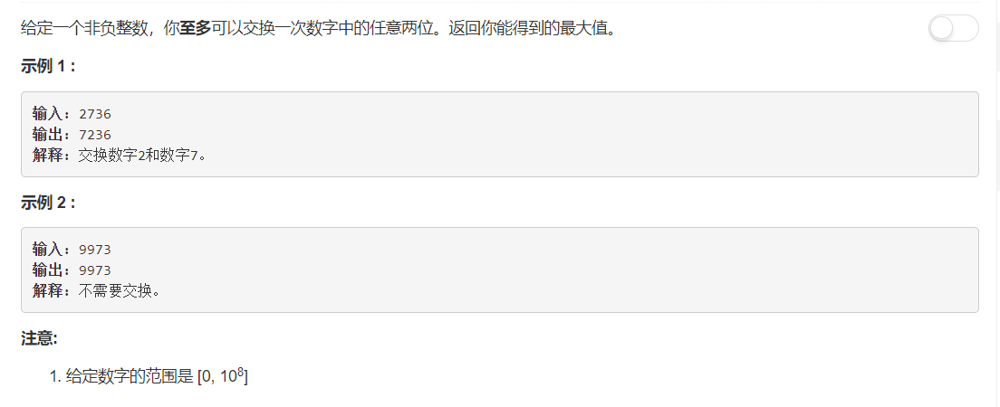

# 670 - 最大交换

## 题目描述


### 题解：  
**思路**
力所能及的把最大的数放到最高位：  
1. 将数字转化为字符串； 
2. 从后往前遍历，找到每个元素后最大元素的位置；
3. 从前往后遍历(高位到低位)，一旦某个位置上的元素不是最大元素即交换；
4. 转化回数字并返回。

```python
class Solution:
    def maximumSwap(self, num):
        """
        :type num: int
        :rtype: int
        """
        nums = str(num)
        n = len(nums)
        maximum = n - 1
        maxs = [0 for i in range(n)]

        # 找到每个元素后的最大值所在位置
        for i in range(n-1, -1, -1):
            if nums[i] > nums[maximum]:
                maximum = i
            maxs[i] = maximum

        # 交换
        for i in range(n):
            if nums[i] != nums[maxs[i]]:
                nums = nums[:i] + nums[maxs[i]] +nums[i+1:maxs[i]] + nums[i] + nums[maxs[i]+1:]
                break
        return int(nums)
```
