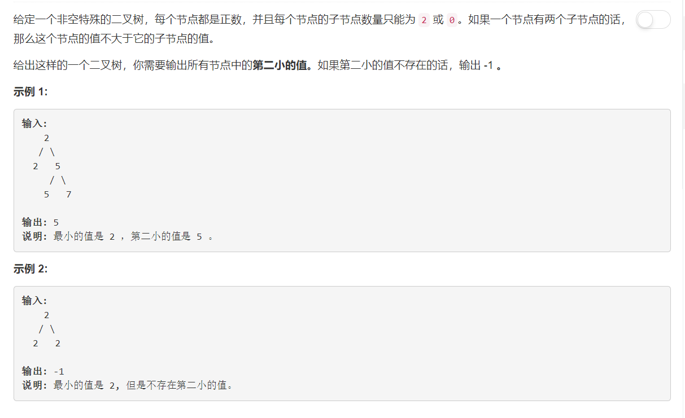

# 671 - 二叉树中第二小的节点

## 题目描述


>关联题目： [230. 二叉搜索树中第K小的元素](https://github.com/Rosevil1874/LeetCode/tree/master/Python-Solution/230_Kth-Smallest-Element-in-a-BST)


## 题解一：【DFS】
**思路：**
1. 根节点一定是最小的节点；
2. 遍历二叉树，每次找到大于根节点并小于当前节点的值a；
3. 遍历完之后a就是大于根节点（最小值）且小于其他所有节点的第二小节点啦。

```python
# Definition for a binary tree node.
# class TreeNode(object):
#     def __init__(self, x):
#         self.val = x
#         self.left = None
#         self.right = None

class Solution(object):
    def findSecondMinimumValue(self, root):
        res = [float('inf')]
        def dfs(node):
            if not node:
                return
            if root.val < node.val < res[0]:
                res[0] = node.val
            dfs(node.left)
            dfs(node.right)
        dfs(root)
        return -1 if res[0] == float('inf') else res[0]
```

- 错误1：UnboundLocalError: local variable 'res' referenced before assignment.
- 原因：在于python没有变量的声明 , 所以它通过一个简单的规则找出变量的范围 ：如果有一个函数内部的变量赋值 ，该变量被认为是本地的，所以如果有修改变量的值就会变成局部变量。
- 解决：用global关键字来进行说明该变量是全局变量；
- 但是...又出错了：NameError: global name 'res' is not defined
- 找不到原因，照原答案把res改成了数组，就不报错了，为什么啊＞︿＜


改进版：
```python
# Definition for a binary tree node.
# class TreeNode(object):
#     def __init__(self, x):
#         self.val = x
#         self.left = None
#         self.right = None

class Solution(object):
    def findSecondMinimumValue(self, root):
        """
        :type root: TreeNode
        :rtype: int
        """
        self.res = float('inf')
        def dfs(node):
            if not node:
                return
            if root.val < node.val < self.res:
                res = node.val
            elif root.val == node.val:      # 只有当前节点等于最小值才有必要向下遍历，否则当前节点至少是第二小，那么其子节点肯定更大，没有探索的必要了。
                dfs(node.left)
                dfs(node.right)
        dfs(root)
        return -1 if self.res == float('inf') else self.res

```

## 题解二：【BFS】
**思路：**使用set：元素唯一，自动排序；emmmmm不过虽然set会自动排序，但是转成list之后还是会乱所以需要再排序一下。

```python
# Definition for a binary tree node.
# class TreeNode(object):
#     def __init__(self, x):
#         self.val = x
#         self.left = None
#         self.right = None

class Solution(object):
    def findSecondMinimumValue(self, root):
        """
        :type root: TreeNode
        :rtype: int
        """
        if not root or not root.left or not root.right:
            return -1

        q = [root]
        minimum = root.val
        vals = set()

        while q:
            node = q.pop(0)
            vals.add(node.val)
            if node.val == minimum:
                if node.left:
                    q.append(node.left)
                if node.right:
                    q.append(node.right)
        if len(vals) == 1:
            return -1
        return sorted(list(vals))[1]
```