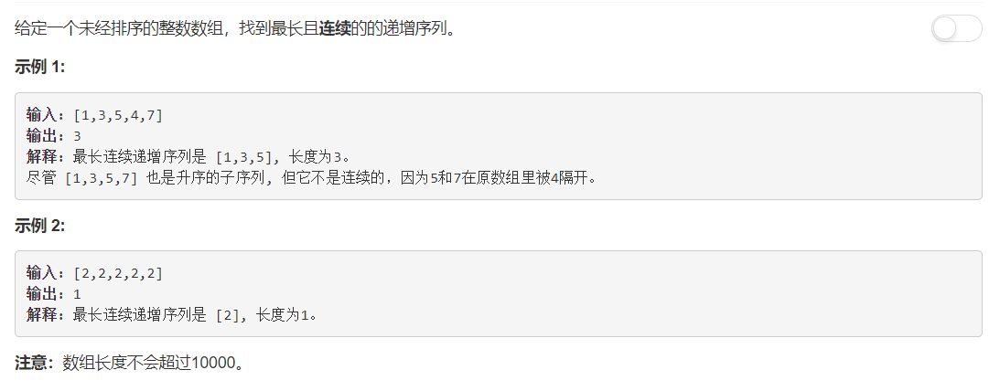

# 674 - 最长递增子序列

## 题目描述



## 方法
就一个个判断是否升序，同时计算递增子序列的长度，返回最长的一个。
```python
class Solution:
    def findLengthOfLCIS(self, nums):
        """
        :type nums: List[int]
        :rtype: int
        """
        if len(nums) == 0:
            return 0
            
        longest = 0
        cnt = 1
        for i in range(1, len(nums)):
            if nums[i] > nums[i - 1]:
                cnt += 1
            else:
                longest = max(longest, cnt)
                cnt = 1
        return max(longest, cnt)
```
